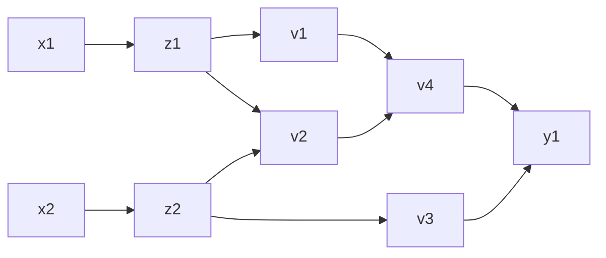
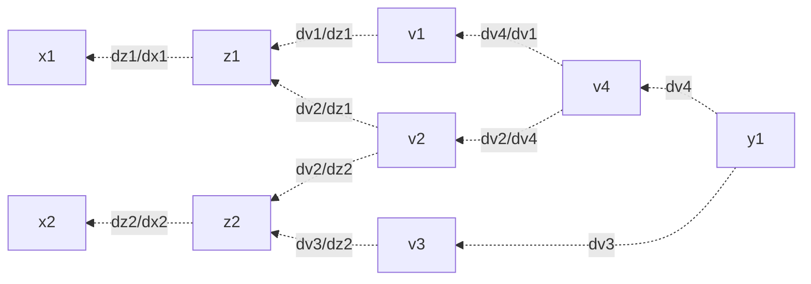

# Apéndice B: Diferenciación automática

Muchos problemas de estadística y aprendizaje se reducen (o se transforman) a optimización sin restricciones para poder utilizar descenso en gradiente estocástico, que permite ajustar modelos con grandes volúmenes de datos. Hay al menos tres soluciones alternativas para evaluar los gradientes:

1. **Hacer la cuenta a mano y programarla explícitamente.** Este fue el único método exacto que se tuvo por mucho tiempo, y sigue siendo el más popular en algunos modelos complicados (como Latent Dirichlet Allocation). Sin embargo, pocas veces es posible.
2. **Diferenciación simbólica.** Usar software como mathematica para simplificar la cuenta, convirtiendo una derivada complicada en función de derivadas más sencillas según las reglas del cálculo. En general es demasiado lento para usarse.
3. **Diferenciación numérica.** Aproximar la derivada por diferencias finitas, por lo que no se necesita conocer su forma analítica. La complejidad $\mathcal{O}(n)$ para el gradiente impide que escale con el tamaño de los datos, y la inestabilidad por el error de truncamiento se vuelve importante.

La diferenciación automática intenta aprovechar la idea simbólica de la regla de la cadena para definir una especie de evaluación no-estándar de la función de interés $f$ En general, podemos expresar $f$ como una composición de funciones con derivadas sencillas: polinomios, exponenciales, logaritmos y funciones trigonométricas. La diferenciación automática construye una gráfica de evaluación de $f$ en términos de estas funciones más sencillas para poder evaluar sólamente derivadas puntuales y conocidas de antemano, y después multiplicar según la regla de la cadena. 

###### Ejemplo.

Consideremos la función $f: \mathbb{R}^2: \to \mathbb{R}$ tal que $f(x)=\log(x_1)+x_1x_2 - \sin(x_2)$. La gráfica de evaluación de $f$ es



Donde

+ $z_i ​$ para $i\in\{1, \cdots , n\}​$ son las variables de entrada
+ $v_i$ para $i \in \{1, \cdots , l\}$ son las variables intermedias y
+ $v_{l+i}=y_i$ para $i\in\{1, \cdots , m\}$ son las variables de salida

Para fijar ideas, supongamos que una observación es $x=(2, 5)^\top$. Calcular $f(x)$ en un primer *paso hacia adelante* se ve así:

```pseudocode
z1 <- x1 <- 2
z2 <- x2 <- 5

v1 <- log(z1) <- log(2)
v2 <- z1*z2 <- 2*5
v3 <- sin(z2) <- sin(5)
v4 <- v1 + v2 <- 0.693 + 10
v5 <- v4 - v3 <- 10.693 + 0.959

y1 <- v5 <- 11.652
```

La diferenciación automática complementa cada variable intermedia $v_i$ con una evaluación adjunta
$$
\bar{v_i} = \frac{\partial y_j}{\partial v_i}
$$
que se hace en un segundo recorrido del grafo, el *paso hacia atrás*. Específicamente nos interesa obtener $\nabla_z y(z)$, y lo hacemos evaluando numéricamente las parciales y aprovechando que por la regla de la cadena 
$$
\frac{\partial y_1}{\partial z_2}=\frac{\partial y_1}{\partial v_2}\frac{\partial v_2}{\partial z_2}+ \frac{\partial y_1}{\partial v_3}\frac{\partial v_3}{\partial z_2}
$$
En el paso hacia atrás (nótese que el orden está invertido con respecto a la evalauación de arriba), tenemos, denotando `dvi` a $\overline{v_i}$ y `parcial(w,z)`a $\frac{\partial w}{\partial z}$ 

```pseudocode
dv5 <- dy <- 1

dv4 <- dv5*parcial(v5, v4) <- dv5*1 <- 1
dv3 <- dv5*parial(v5, v3)<- dv5*(-1) <- -1
dv1 <- dv4*parcial(v4, v1) <- dv4*1 <- 1
dv2 <- dv4*parcial(v4, v2) <- dv4*1 <- 1
dz2 <- dv3*parcial(v3, z2) <- dv3*cos(z2) <- -0.284
dz1 <- dv2*parcial(v2, z1) <- dv2*z2 <- 5
dz2 <- dz2 + dv2*parcial(v2,z2) <- dz2 + dv2*z1 <- 1.716
dz1 <- dz1 + dv1*parcial(v1, z1) <- dz1 + dv1/v1 <- 5.5

dx2 <- dz2 <- 1.716
dx1 <- dz1 <- 5.5
```

Que coincide con el grafo aumentado



en el que las aristas de regreso nos permiten calcular derivadas parciales de manera numérica fácilmente, pues el grafo se construyó precisamente para que cada arista fuese una operación sencilla de derivar. 

Esta forma de calcular derivadas numéricamente aprovecha la precisión de los métodos simbólicos con la facilidad de cómputo de los métodos numéricos, y permite abstraer el cálculo explícito del gradiente o incluso su cálculo numérico directo. Por esto ADVI puede trabajar con cualquier modelo siempre que pueda derivarse, y por esto también no era posible trabajar sin "meter" el gradiente a la esperanza. ¿Cómo se expresaría la esperanza en un grafo como este?

