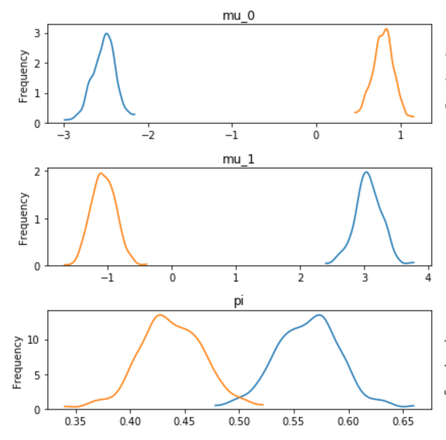
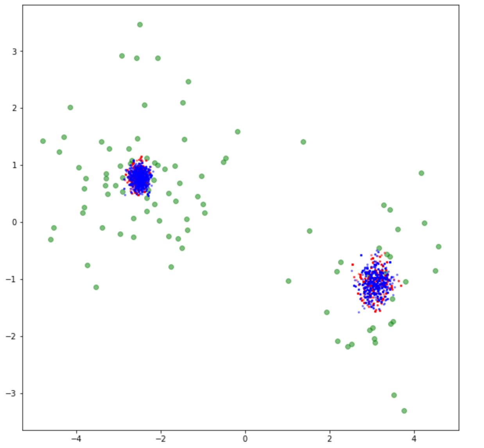
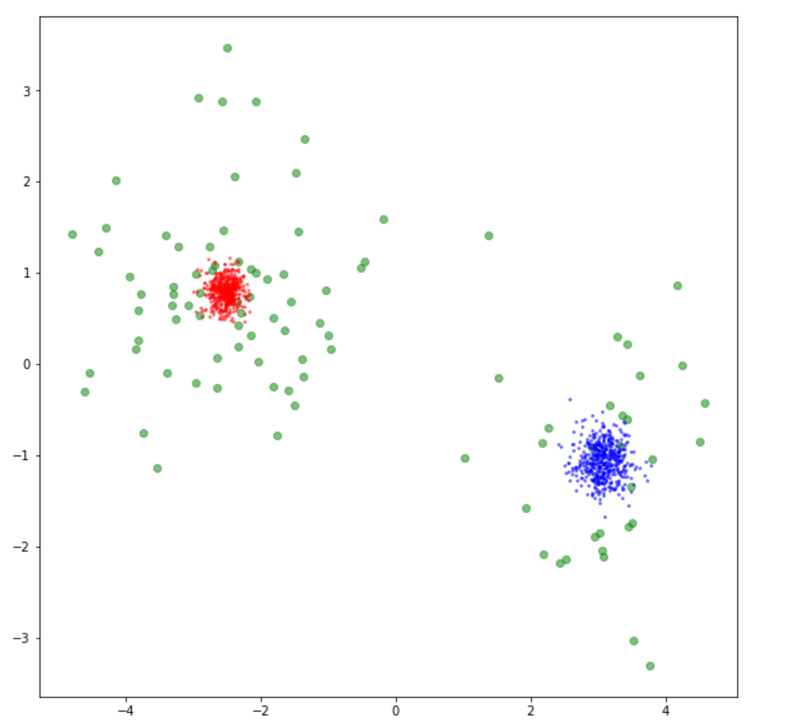
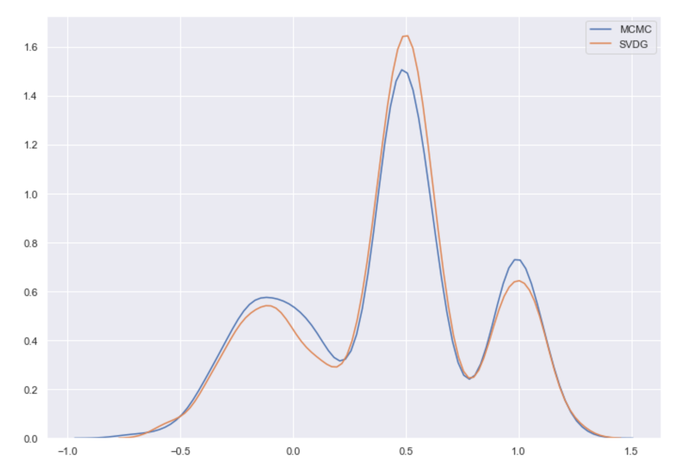

## Ejemplos

#### ADVI

Sea $X \in \mathcal{M}_{n \times p}$ una matriz de datos donde cada obervación $x_i$ se distribuye como una mezcla de $K$ normales $p$ variadas, es decir
$$
x_i \sim \sum_{j=1}^K \pi_j \mathcal{N}_p( \mu_j, \mathbb{I}) \quad \sum_j \alpha_j = 1
$$
Donde los vectores de medias $\mu_j$ y las proporciones $\pi_j$ son previamente definidos.

El primer ejemplo consiste en btener una muestra de dicha distribución dados $n$, $p$ y $K$ (generando las $\mu$ y las $\pi$ se generan aleatoriamente) y posteriormente definir el siguiente modelo
$$
\begin{align*}
 x | \ \pi, \mu &\sim \sum_{j=1}^K \pi_j \mathcal{N}_p( \mu_j, \mathbb{I}) \\ 
\end{align*}
$$
Con priors
$$
\begin{align*}
\pi_i &\sim \mathrm{Dirichlet(100)} \\
\mu_i &\sim \mathcal{N}(\bold{0},100\mathbb{I}) \\
\end{align*}
$$
Y obtener una muestra de la distribución posterior dada la muestra generada.

Se generaron datos con respecto al procedimiento anterior considerando
$$
\mu_1 = \begin{pmatrix} -2.3 \\ .77 \end{pmatrix} \quad \pi_1 = .68 \nonumber\\ 
\mu_2 = \begin{pmatrix} 3 \\ -.71 \end{pmatrix} \quad \pi_2 = 32
$$
Tras obtener una muestra de la posterior con los datos generados obtenemos los siguientes resultados

|                    MCMC                     |                    ADVI                     |
| :-----------------------------------------: | :-----------------------------------------: |
|  |  |
|                                             |                                             |

En la columna de ADVI cada color es una de las componentes. Como podemos ver, ADVI construyó adecuadamente la distribución de cada componente. Por otro lado, MCMC no pudo detectar la estructura adecuadamente por el problema de reetiquetado.

A continuación realizamos una visualización en la cual se grafican de color verde la muestra original, de color azul aquellos generados por una distribución normal con la media $\hat{\mu}_0$ posterior obtenida tras el muestreo y de color rojo aquellos generados por una distribución normal con la media $\hat{\mu}_1$correspondiente.

| MCMC                                        | ADVI                                        |
| ------------------------------------------- | ------------------------------------------- |
|  |  |

En ADVI se obtienen los puntos correctos, en MCMC obtenemos puntos rojos y azules mezclados. Esto se debe a un problema de etiquetación que surge al utilizar métodos de Monte Carlo en modelos de mezclas gaussianas.

Una aplicación de ADVI en un modelo de dimensiones más grandes ($p=100$, $K=10$, $n=100000$) y haciendo uso de *minibatch* se encuentra presente -junto con el código anterior- en el apéndice E.

#### SVGD

Se utilizó un ejemplo sencillo para mostrar el funcionamiento de SVGD, el código fuente está presente en el apéndice E. Obtener una muestra de 
$$
\begin{align*}
X  & \sim .3Y_1 + .5Y_2 + .2Y_3 \\ \\
Y1 & \sim N(-.1,.2) \\
Y2 & \sim N(.5,.1) \\
Yy & \sim N(.1,.1)
\end{align*}
$$

SVGD logró capturar adecuadamente la estructura multimodal de los datos.
