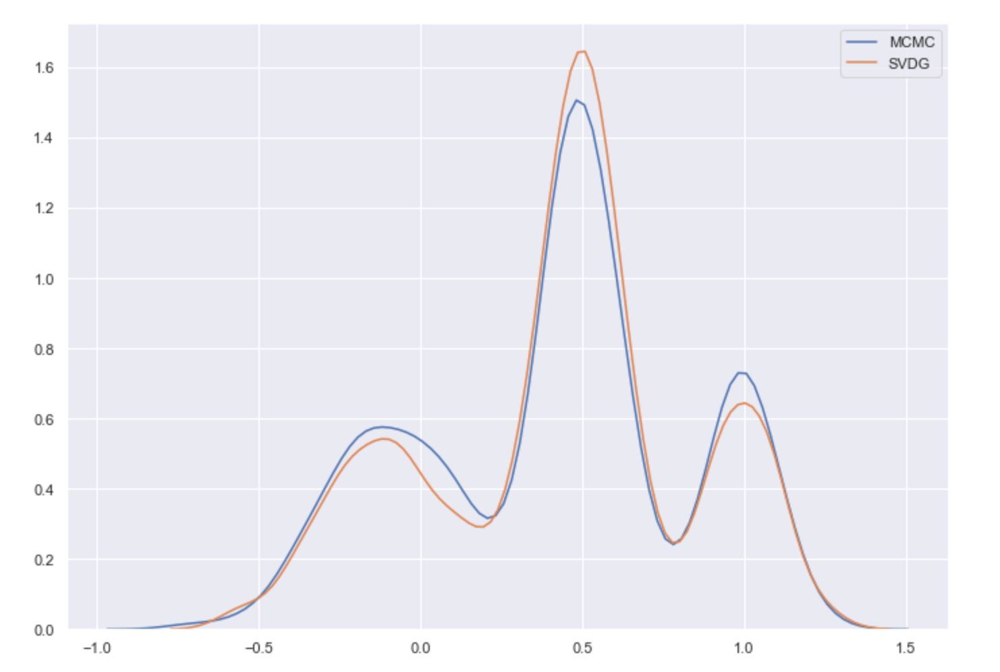

## Motivación

Consideremos el problema típico de inferencia bayesiana:
$$
p(\theta | \textbf{x}) = \frac{p(\theta) \ p(\textbf{x} | \theta)}{p(\textbf{x})} \propto p(\theta) \ p(\textbf{x} | \theta)
$$
En muchos modelos bayesianos, la dificultad o imposibilidad para calcular $p(\mathbf{x})$ (que es una integral en dimensiones potencialmente altas) vuelve problemático obtener una forma analítica de la distribución posterior, pese a que la técnica más común para aproximarla son los métodos de MCMC, hay ciertos contextos en los que fallan. En particular, es difícil determinar la convergencia, y en problemas muy complicados o de escala masiva pueden ser demasiado lentos para ser de utilidad práctica. 

A continuación mostramos tres de modelos que, dada su complejidad intrínseca, presentan problemas de escalabilidad al utilizar métodos de MCMC.

###### Latent Dirichlet allocation (LDA).

LDA es un modelo probabilístico generativo ampliamente utilizado en procesamiento de lenguaje natural para resolver problemas de clasificación de texto y modelado de temas, la idea básica del procedimiento para generar un documento es la siguiente: 

Supongamos que se tiene un vocabulario de palabras y un conjunto de temas, entonces, para cada tema podemos obtener una distribución de las palabras que aparecen en él. De esta forma, para generar un documento, se elige una distribución de los temas que se van a tratar en el documento y con base en ella se obtiene el conjunto de palabras correspondiente. El modelo probabilístico es el siguiente:

1. Elige el número de palabras de el documento, $N \sim \mathrm{Poisson}(\xi)$.

2. Elige un parámetro para la distrubución de los temas del documento,  $\theta \sim \mathrm{Dir}(\alpha)$.

3. Para cada una de las N palabras $w_n$:

   a. Elige un tema $z_n \sim \mathrm{Multinomial}(\theta)$.

   b. Elige una palabra $w_n$ de $p(w_n|z_n,\beta)$, una distribución multinomial condicionada en el tema $z_n$.

###### Modelo de mezcla gaussiana.

Dado un conjunto de observaciones se desea obtener una muestra de la posterior del modelo:
$$
p(y \ |\ \theta,\mu,\sigma) = \prod_{n=1}^N\sum_{k=1}^K\theta_k\prod_{d=1}^D \mathscr{N}(y_{nd} | \mu_{kd},\sigma_{kd})
$$
Con una _prior_ Dirichlet para las proporciones de la mezcla:
$$
p(\theta) = Dir(\theta; \alpha_0)
$$
Una _prior_ Gaussiana para las medias de las mezclas:
$$
p(\mu) = \prod_{k=1}^{D} \prod_{d=1}^D \mathscr{N}(\mu_{kd};0,1)
$$
Y una _prior_ Lognormal para las desviaciones estandar de las mezclas:
$$
p(\sigma) = \prod_{k=1}^D \prod_{d=1}^D  \mathrm{Lognormal}(\sigma_{kd};0,1)
$$

###### Componenetes principales probabilísticos con detección automática de relevancia.

Inicialmente, se considera el modelo de componenetes principales probabilísticos (PPCA), supongamos que se tiene un conjunto de datos $\bold{x} = x_{1:n}$ donde cada $x_i \in \mathbb{R^n}$. Sea M<D la dimensión del subespacio buscado, definimos:
$$
\begin{eqnarray}
p(\bold{x} | \bold{w},\bold{z},\sigma) &=& \prod_{n=1}^N \mathscr{N}(x_n; \bold{w}z_n,\sigma\mathbb{I}) \\
p(\bold{z}) &=& \prod_{n=1}^N \mathscr{N}(z_n;0,\mathbb{I}) \\
p(\bold{w}) &=& \prod_{n=1}^D \mathscr{N}(w_n;0,\mathbb{I}) \\
p(\sigma) &=& \mathrm{Lognormal}(\sigma;0,1) \\
\end{eqnarray}
$$
Donde $\bold{w} = w_{1:D}$ es  un conjunto de componentes principales

La detección automática de relevancia consiste en extender PPCA al añadir un vector M-dimensional $\bold{\alpha}$ que elige las componentes principales que serán retenidas al añadir:
$$
p(\bold{w} | \bold{\alpha}) = \prod_{n=1}^D \mathscr{N}(w_d;0,\sigma \mathrm{diag}(\alpha)) \\
p(\bold{\alpha}) = \prod_{n=1}^M \mathrm{Invgamma}(\alpha_m;1,1)
$$

#### Inferencia variacional

Una alternativa más eficiente es la *inferencia variacional*, que replantea el problema como uno de optimización determinista al proponer una familia de densidades $\mathscr{Q}$ sobre $\theta$ y aproximar la distribución posterior $\bar{p}$
$$
q^* = \underset{q \in \mathscr{Q}}{\arg\min} \{ D_{KL}(q  || p)\}
$$
Pese a la eficiencia en términos computacionales de la inferencia variacional, su uso como método general presenta ciertas complicaciones puesto que requiere de un diseño cuidadoso de la rutina de optimización: encontrar una familia variacional adecuada al modelo, obtener explícitamente la función objetivo y su gradiente (esto puede llegar a ser sumamente complicado) y realizar un procedimiento de optimización apropiado. 

Han surgido múltiples propuestas que pretenden automatizar computacionalmente el proceso de optimización, en este proyecto se discutirán dos algoritmos publicados en el 2016 que resuelven el problema por optimización estocástica ADVI y SVGD. El primero, reparametriza de manera automática para optimizar de una familia $\mathcal{Q}$ fija de antemano. El segundo, construye una especie de descenso en gradiente en un reproducing kernel hilbert space (RKHS) apropiado de manera que se minimice la divergencia de Kullback-Leibler

## Inferencia variacional

La inferencia variacional transforma el problema de muestreo a un problema de optimización determinista. En particular, formula el prolema
$$
q^* = \underset{q \in \mathscr{Q}}{\arg\min} \ D_{KL}(q \ || \ \bar{p})  
$$
donde $D_{KL}$ es la *divergencia de Kullback-Leibler*
$$
D_{KL}(q\ ||\ \bar{p}) = \mathbb{E}_{\theta \sim q}\left[\log\frac{q(\theta)}{\bar{p}(\theta)}\right]
$$
 y  $\mathscr{Q}$ una familia de funciones de probabilidad definida de antemano. En el apéndice A se explica con detalle la construcción y significado de la divergencia de Kullback-Leibler, pero por ahora basta saber que mide la cantidad de información perdida por utilizar $q$ en vez de $\bar{p}$. 

Lamentablemente, es imposible optimizar Kullback-Leibler de manera directa, pues
$$
\begin{align}
D_{KL}(q \ || \ \bar{p}) &= \mathbb{E}_{\theta\sim q}[\log q(\theta)] - 
	\mathbb{E}_{\theta\sim q}[\log \bar{p}(\theta)]\\ 
&= \mathbb{E}_{\theta\sim q}[\log q(\theta)] - 
	\mathbb{E}_{\theta\sim q}[\log p(\theta , x)] + \log p(x) \\
\end{align}
$$
Como la divergencia depende de la marginal de $x$, cuya dificultad de cálculo es la razón por la cuál usamos métodos aproximados de inicio, optimizamos en su lugar la siguiente función.

###### Definición.

La *cota inferior a la evidencia* es la función 
$$
\mathrm{ELBO}(q) = \mathbb{E}_{\theta\sim q}\left[\log \frac{p(\theta , x)}{q(\theta)}\right]
$$
###### Observación.

$$
\begin{align}
\mathrm{ELBO}(q) &= \mathbb{E}_{\theta\sim q}[\log p(\theta , x)] - 
	\mathbb{E}_{\theta\sim q}[\log q(\theta)] \\
&= \log p(x) - D_{KL}(q \ || \ \bar{p})
\end{align}
$$
Y como $\log p(x)$ es un valor fijo, maximizar $\mathrm{ELBO}(q)$  es equivalente a minimizar la divergencia de Kullback-Leibler. Recordando que evidencia es el término usual para la marginal de $x$ en el modelo, el nombre de la función $\mathrm{ELBO}$ se justifica con lo siguiente.

###### Proposición.

$$
ELBO(q) \leq \log p(x)
$$
> *Demostración*.
>
> Basta recordar que por ser una divergencia, $D_{KL}(q\ ||\ \bar{p}) \geq 0. \ \ _\square$ 


## ADVI: inferencia variacional con diferenciación automática


ADVI es un algoritmo introducido, entre otros, por Andrew Gelman y David Blei en 2016. En resumen, dada la especificación de un modelo $p(x, \theta)$, ADVI lo transforma a $p(x, \zeta) $(ajustando por el mapa $\theta \mapsto \zeta$ en la nueva conjunta) donde $\zeta \in \mathbb{R}^p$. Así elimina las restricciones sobre el parámetro $\theta$, y es posible fijar $\mathscr{Q}$ de antemano y utilizarla para cualquier modelo. Después, ADVI transforma la función objetivo a un valor esperado sobre la función propuesta, de manera que pueda aproximarse con métodos de Monte Carlo, y resuelve la optimización con una variante de gradient descent.

Comencemos por definir los modelos que ADVI puede resolver: los modelos diferenciables.

###### Definición.

Un modelo de probabilidad $p(x, \theta)$ es *diferenciable* si $\theta$ es continua y existe $\nabla_\theta\log p(x, \theta)$ en el soporte   $\Theta \subseteq \mathbb{R}^p$  de $\theta$.

Esta clase es más extensa de lo que puede parecer a primera vista, pues considerando que se puede marginalizarse sobre las variables discretas incluye no sólo a los modelos lineales generalizados y procesos gaussianos, sino también de modelos de mezclas, latent Dirichlet allocation y hidden Markov models.

Estudiemos con más detalle el funcionamiento de ADVI.

#### Transformación automática de variables

El primer paso del algoritmo es transformar los parámetros del modelo, de $\theta \in \Theta \subseteq \mathbb{R}^p$ a $T(\theta) = \zeta \in \mathbb{R}^p$. Habiendo elegido $T$, la nueva conjunta es
$$
p(x,\zeta) = p(x, T^{-1}(\zeta))|\det \mathbb{J}_{T^{-1}}(\zeta)|
$$
donde $\mathbb{J}_f$ es la derivada de $f$. Los resultados no son invariantes ante la elección de $T$, pero calcular la transformación óptima es un problema equivalentemente difícil, pues depende de la distribución de $\theta|X$. Hay trabajo en curso para mejorar la elección, pero por ahora basta saber que las implementaciones computacionales (Stan y PyMC3) se encargan de esto.

#### El problema variacional en $\mathbb{R}^p$

ADVI implementa dos de las familias $\mathscr{Q}$ más prominentes en la literatura para $\Theta=\mathbb{R}^p$:

###### Definición.

La familia *mean-field gaussian* es el conjunto de distribuciones de la forma
$$
q(\zeta;\phi) = \mathscr{N}(\zeta;\mathbf{\mu},\mathrm{diag}(\exp(\omega)^2))
= \prod_{i=1}^p\mathscr{N}(\zeta_i;\mu_i,(e^{\omega_i})^2)
$$
donde $\omega = \log(\sigma)$ es una reparametrización que permite tener un espacio parametral libre, pues $\phi = (\mu_1, \cdots, \mu_p, \omega_1, \cdots, \omega_p)^\top \in \mathbb{R}^{2p}$ .

###### Definción.

La familia *full rank gaussian* es el conjunto de distribuciones de la forma
$$
q(\zeta;\phi) = \mathscr{N}(\zeta;\mu, LL^\top)
$$
donde $LL^\top$ es la factorización de Cholesky de $\Sigma = \mathrm{Cov}(\zeta)$. En este caso, la matriz tiene $p(p+1)/2$ parámetros reales y $\phi \in \mathbb{R}^{p+p(p+1)/2}$.

Analizando de manera rápida el *bias-variance tradeoff* de la elección de modelo, usando full rank el espacio de parámetros sube de $\mathcal{O}(p)$ a $\mathcal{O}(p^2)$, por lo que la estimación se complica, pero sí nos permite expresar correlación entre las entradas de $\zeta$, una estructura mucho más rica.

Notemos también que aunque $q$ es normal en el espacio de coordenadas de $\zeta$,  no lo es en el espacio de $\theta$; pues implícitamente definimos la variacional en el espacio original al definir $T$.
$$
q^*(\theta)= q(T(\theta);\phi)|\det\mathbb{J}_T(\theta)|
$$
que no necesariamente es normal.

Aquí la familia $\mathscr{Q}$ ya está parametrizada sobre $\phi$, por lo que denotaremos $q_\phi(\zeta)=q(T(\theta);\phi)$.

Una vez transformado el parámetro, el objetivo es minimizar
$$
\mathrm{ELBO}(q_\phi) =
\mathbb{E}_{\zeta\sim q_\phi}[\log p(x,T^{-1}(\zeta))
	+\log|\det\mathbb{J}_{T^{-1}}(\zeta)|]
	+\mathbb{H}(q_\phi)
$$
donde $\mathbb{H}$ es la entropía de Shannon (más en el apéndice A).  Como el parámetro transformado toma valores reales, el problema de inferencia variacional es
$$
\phi^*=\underset\phi{\arg\max}\ \mathrm{ELBO}(\phi)\
$$
Como no hay restricciones, podemos resolverlo por ascenso en gradiente. Sin embargo, no podemos usar diferenciación automática directamente en $\mathrm{ELBO}$. ADVI implementa una transformación más para poder "meter" el gradiente a la esperanza, para después utilizar integración de Monte Carlo. Específicamente, buscamos una transformación $S_\phi$ que absorba los parámetros variacionales para convertir la aproximación variacional a una normal estándar.

###### Proposición.

En el caso *mean-field*, la adecuada es $S_\phi(\zeta) = \mathrm{diag}(\exp(\omega))^{-1}(\zeta-\omega)$; y en el caso *full-rank* $S_\phi(\zeta)=L^{-1}(\zeta-\mu)$

> *Demostración*
>
> Basta notar que el primer caso es un caso particular del segundo, y el segundo se probó en clase cuando simulamos normales desde normales estándar. $_\square$

Así pues, tras aplicar la transformación, la distribución variacional es
$$
q(\xi)=\mathcal{N}(\xi;0,\mathbb{I}) = \prod_{i=1}^p(\xi_i; 0, \mathbb{I})
$$

###### Definición.

La transformación $S_\phi$ se llama *estandarización elíptica*.

Esta transformación convierte el problema de optimización en
$$
\phi^*=\underset{\phi}{\arg\max} \
\mathbb{E}_{\xi\sim\mathcal{N}(0,\mathbb{I})}\left[\log p\left(x, T^{-1}(S_\phi^{-1}(\xi)\right)
+ \log \left|\mathbb{J}_{T^{-1}}(S^{-1}_\phi(\xi))\right|\right]
+ \mathbb{H}(q_\phi)
$$

###### Teorema.

$$
\begin{align}
\nabla_\mu\mathrm{ELBO}(q) &=
	\mathbb{E}_{\xi\sim\mathcal{N}(0,\mathbb{I})}\left[
	\nabla_\theta\log p(x,\theta)\nabla_\zeta T^{-1}(\zeta) +
	\nabla_\zeta\log|\mathrm{det}\mathbb{J}_{T^{-1}}(\zeta)|
	\right] \\ \nonumber \\

\nabla_\omega\mathrm{ELBO}(q) &= \mathbb{E}_{\xi\sim\mathcal{N}(0,\mathbb{I})}\left[
	(\nabla_\theta\log p(x,\theta)\nabla_\zeta T^{-1}(\zeta) +
	\nabla_\zeta\log|\mathrm{det}\mathbb{J}_{T^{-1}}(\zeta)|)
	\xi^\top\mathrm{diag}(\exp(\omega))
	\right] +1 \\ \nonumber \\

\nabla_L\mathrm{ELBO}(q) &= \mathbb{E}_{\xi\sim\mathcal{N}(0,\mathbb{I})}\left[
	(\nabla_\theta\log p(x,\theta)\nabla_\zeta T^{-1}(\zeta) +
	\nabla_\zeta\log|\mathrm{det}\mathbb{J}_{T^{-1}}(\zeta)|)\xi^\top
	\right] + (L^{-1})^\top
\end{align}
$$

> *Demostración*
>
> Apéndice C del paper de Gelman. $_\square$

Es por las ecuaciones $(28)-(30)$ que ADVI trabaja con la clase de modelos diferenciables. Nótese que aunque no podíamos calcular el gradiente de la esperanza en (24), sí podemos calcular expresiones complicadas como $(28)-(30)$. Esto se debe a la diferenciación automática (la otra mitad en el nombre de ADVI), que por ser más una genialidad computacional que estadística evitamos aquí entrar en detalles y los desarrollamos en el apéndice B. Basta saber que los gradientes en $(28)-(30)$ son fáciles de evaluar, por lo que podemos usar descenso en gradiente.

#### Una rutina de optimización

Con una forma del gradiente conveniente para los métodos de Monte Carlo, basta elegir un algoritmo de optimización. En los modelos de altas dimensiones, un algoritmo debería adaptarse a la curvatura del espacio (siguiendo el trabajo de Sun Ichi Amari sobre la geometría de la información) y al mismo tiempo  dar pasos que decrezcan en magnitud suficientemente rápido. 

Los autores de ADVI proponen el siguiente esquema de ascenso en gradiente:

En la iteración $i$, sean $\rho^{(i)}$ el tamaño del paso y $g^{(i)}$ el gradiente.  Definimos
$$
\rho^{(i)}_k=\eta\times i^{-1/2+\epsilon}\times\left(\tau+\sqrt{s_k^{(i)}}\right)^{-1}
$$
donde aplicamos la actualización recursiva
$$
s_k^{(i)}=\alpha\left(g^{(i)}_k\right)^2+(1-\alpha)s_k^{(i-1)} \\
s_k^{(1)} = \left(g_k^{(1)}\right)^2
$$
y damos así el paso en el espacio $\mathrm{ELBO}$ 
$$
\theta^{(i)}=\theta^{(i-1)}+\rho^{(i)}g^{(i)}
$$
Antes de entrar en más detalle, la ecuación $(33$) muestra la intuición del algoritmo: estando en un punto  $\theta^{(i-1)}$, damos un paso tamaño $\rho^{(i)}$ en la dirección de mayor aumento de $\mathrm{ELBO}$. Este es el algoritmo de *ascenso en gradiente*. Aunque pueda parecer ingenuo, su popularidad se debe a que en gradientes en el formato de $(38)-(30)$, $\nabla_\theta f(\theta) = \mathbb{E}_x[h(x,\theta)]$, podemos aproximar la esperanza con una muestra pequeña (es un estimador de Monte Carlo) y así eficientar el proceso para grandes volúmenes de datos.

En $<span class="md-search-hit">(</span>31)$, el término $ \eta > 0$ determina la escala de la sucesión de pasos (o tasas de aprendizaje en jerga de aprendizaje). Los autores recomiendan elegir $\eta \in \{0.01, 0.1, 1, 10, 100\}$ usando todos los valores en un subconjunto pequeño de los datos y elegir el de convergencia más rápida. El término $i^{1/2+\epsilon}$ decae con la iteración para dar pasos cada vez más pequeños como exigen las condiciones de Robbins y Monro para garantizar convergencia. 

 El último factor se adapta a la curvatura del espacio $\textrm{ELBO}$, que por la reparametrización es distinto al original. Los valores de $s$ guardan la información sobre los gradientes anteriores, y el factor $\alpha $determina qué tan importante es el valor histórico en comparación con el valor actual. La sucesión $\left(s^{(n)}\right)_{n\in\mathbb{N}}$ converge a un valor no nulo.

Los valores de $\epsilon$ y $\tau$ son para estabilidad numérica, y los autores lo fijan en $10^{-16}$ y $1$ respectivamente. Finalmente podemos presentar el algoritmo.

#### Algoritmo

```pseudocode
advi(data=x, model=p(x,theta), mean_field=TRUE):
""" ADVI: Automatic differentiation variational inference.
	
	Parámetros:
	-----------
	data (data frame):
		Las observaciones.
	model (modelo de probabilidad):
		Especificación del modelo. Usualmente en algún software de programación 
		probabilística como Stan o PyMC3
	mean_field (boolean):
		TRUE si se quiere mean-field. FALSE si se quiere full-rank.
	
	Regresa:
	--------
	(arreglo):
		La media de la normal variacional
	(arreglo):
		El vector necesario para explicar la covarianza. Tiene longitud si
		se usa mean-field o p+p(p+1)/2 si se usa full-rank
	
"""
	eta <- Determinar por grid search con un subconjunto de datos
	mu[1] <- 0
	if mean_field:
		omega[1] <- 0
	else
		L[1] <- matriz_identidad
		
	while cambio en ELBO > tol: 
		eta <- muestrear M de normal multivariada estándar
		grad_mu(ELBO) <- aproximar (28) con integración de MC 
		if mean_field:
			grad_omega(ELBO) <- aproximar (29) con integración de MC
		else:
			grad_L(ELBO) <- aproximar (30) con integración de MC
		rho <- calcular con las ecuaciones (31) y (33)
		mu <- mu + rho*grad_mu(ELBO)
		if mean_field:
			omega <- omega + rho*grad_omega(ELBO)
		else
			L <- L + diag(rho)*grad_L(ELBO)
	return([mu, omega if mean_field else L])
```

Si se usa descenso en gradiente, ADVI tiene complejidad $\mathcal{O}(nMp)$ por iteración, donde $n$ es la cantidad de datos. En la variante estocástica con minibatch, pueden usarse $b\ll n$  puntos y baja a $\mathcal{O}(bMp) $para escalar a datos masivos.

#### Última nota

¿Cómo elegir entre full-rank y mean-field? Los autores recomiendan utilizar full-rank sólo cuando interesan las covarianzas (y varianzas) posteriores, pues cuando sólo interesa la media posterior, mean-field es suficientemente bueno y sustancialmente más rápido.

## Evaluación

La inferencia variacional reduce el tiempo de cómputo para muestrear posteriores complicadas, pero da sólo un aproximado. ¿Cómo podemos verificar qué tan bueno es el aproximado? Primero, es fácil diagnosticar la convergencia del algoritmo de optimización monitoreando el cambio en $\mathrm{ELBO}$, y esto siempre debería hacerse. Sin embargo, puede ser que incluso habiendo convergido el algoritmo a un máximo global de $\mathrm{ELBO}$, la familia  $\mathscr{Q}$ haya sido elegido tan desafortunadamente que aún el óptimo es malo o que por la poca penalización que $D_{KL}(q\ ||\ p)$ le pone a las colas ligeras tenagmos una densidad muy distinta a la verdadera.

Yao *et al.* (2018) proponen dos diagnósticos cuantitativos, uno para la calidad de la posterior variacional y otro para evaluar la calidad de los estimadores puntuales que podemos derivar de ella. Referimos al lector al paper original para el segundo y trataremos aquí sólo el primero.

Como vimos durante el curso, puede estimarse para cualquier función integrable $h$, $\phi = \mathbb{E}_{\theta\sim \bar{p}}[h(\theta)]$ con métodos de Monte Carlo, y la ventaja del *importance sampling* en situaciones como esta, cuando es difícil muestrear de $\bar{p}$.

Consideremos el estimador, para una muestra $\{\theta_i:i=1,\cdots,n\}$ de la posterior variacional $q$,
$$
\mathbb{E}_{\theta\sim\bar{p}}[h(\theta)]\approx\frac{\sum_{i=1}^nh(\theta_i)w_i}{\sum_{i=1}^nw_i}
$$
Cuando $w_i\equiv1$, estamos confiando completamente en la aproximación, pues la expresión se simplifica al estimador de monte carlo crudo para $\mathbb{E}_{\theta\sim q}[h(\theta)]$.

###### Proposición.

Si $w_i = p(\theta_i, x)/q(\theta_i)=(\bar{p}(\theta_i)p(x)/q(\theta_i))$, el estimador de (34) es importance sampling usando $q$.

> *Demostración*.
> $$
> \begin{align}
> \frac{\sum_{i=1}^n\frac{h(\theta_i)p(\theta_i,x)}{q(\theta_i)}}
> 	{\sum_{i=1}^n\frac{p(\theta_i,x)}{q(\theta_i)}}&\approx
> 	\frac{n\mathbb{E}_{\theta\sim q}\left[\frac{h(\theta)p(\theta,x)}{q(\theta)}\right]}{n\mathbb{E}_{\theta\sim q}\left[\frac{p(\theta,x)}{q(\theta)}\right]} \\
>
> &=\frac{\mathbb{E}_{\theta\sim q}\left[\frac{h(\theta)\bar{p}(\theta)p(x)}{q(\theta)}\right]}{\int_\Theta p(x,\theta)d\theta} \\
>
> &=\frac{p(x)\mathbb{E}_{\theta\sim\bar{p}}[h(\theta)]}{p(x)} \\
>
> &= \mathbb{E}_{\theta\sim\bar{p}}\left[h(\theta)\right]
>
> \end{align}
> $$
>

¿Existirá una manera intermedia, un mejor *bias-variance tradeoff* que las dos opciones anteriores?

#### Pareto smoothed importance sampling

Notemos que en $(35)$, como $q$ fue obtenida por inferencia variacional y puede tener colas mucho más ligeras que la posterior $\bar{p}$, los sumandos pueden hacerse grandes. Pareto smoothed importance sampling (PSIS) es una técnica de reducción de varianza introducida por Vehtari *et al.* (2017), que ajusta una distribución pareto generalizada a los $M = \min\{n/5, 3\sqrt n\}$ valores más grandes de $w_i$ y luego los reemplaza por su valor esperado bajo esta distribución.

###### Definición.

Una variable aleatoria $X$ tiene distribución *pareto generalizada* con parámetro $\theta = (k, \mu, \sigma)^\top$ si su densidad es
$$
p(x|\theta)=
\begin{cases}
\frac{1}{\sigma}\left(1+k\left(\frac{x-\mu}{\sigma}\right)\right)^{-1/k-1},\  k\ne0 \\
\frac{1}{\sigma}\exp\left(\frac{y-\mu}{\sigma}\right),\ \ \ \  k=0
\end{cases}
$$
La siguiente propiedad del parámetro $k$, que enunciamos sin demostración, nos permite usarlo como medida de discrepancia entre la verdadera posterior y la posterior variacional.

###### Teorema.

Si $X$ es una pareto generalizada con parámetro $\theta$,
$$
k = \underset{k'>0}{\inf} \left\{ \mathbb{E}_{\theta\sim q}\left[\frac{\bar{p}(\theta)}{q(\theta)}\right]^\frac{1}{k'} < \infty \right\} =
\underset{k'>0}{\inf}\left\{\mathbb{E}_{\theta\sim q}\left[\frac{p(x,\theta)}{q(\theta)}\right]^\frac{1}{k'}\right\}
= \underset{k'>0}{\inf}\left\{D_\frac{1}{k'}(\bar{p}\ ||\ q)<\infty\right\}
$$

######

Donde $D_\alpha$ es la *divergencia de Rényi de orden* $\alpha$
$$
D_\alpha(\bar{p}\ ||\ q)=\frac{1}{\alpha-1}\int_\Theta p(\theta)^\alpha
q(\theta)^{1-\alpha}d\theta
$$

###### Corolario.

Si $k>1/2$, la divergencia $\chi^2$ es infinita, y si $k >1$, $D_{KL}(\bar{p} || q) = \infty$.

¿Por qué aproximar $k$ es una buena prueba? Aunque sabemos que estamos en un mínimo (por lo menos local) de $D_{KL}(q\ ||\ \bar{p})$ para $q \in \mathscr{Q}$ , es preocupante que la divergencia en el sentido opuesto sea infinita. En la práctica, los autores sugieren descartar la inferencia desde $\hat{k} \geq 0.7$.

#### Algoritmo

```pseudocode
diagnostico_psis(conjunta=p(x, theta), x=datos, n, tol):
"""Diagnóstico de inferencia variacional.

	Parámetros:
	-----------
	conjunta (modelo de probabilidad):
		La distribución conjunta.
	n (entero):
		El número de muestras de la posterior variacional.

	Regresa:
	--------
	bandera (entero):
		Indicador que vale 0 si la aproximación es muy buena, 1 si es
        buena y -1 si es mala, según el criterio de arriba.
"""

q <- obtener por inferencia variacional
theta <- muestrear n puntos de q
w <- p(theta, x)/q(theta)
k_gorro <- ajustar una pareto generalizada a los M mayores valores de theta y
			reportar el valor del parámetro de forma
if k < 0.5
	return 0
else if k < 0.7
	return 1
else
	return -1
```

Cuando $\Theta$ tiene dimensión alta, los métodos variacionales pierden poder predictivo. En este caso, los autores recomiendan limitarse a evaluar los estimadores puntuales con su segundo método.

#### Otra forma de mejorar el ajuste

Recientemente se ha intentado corregir el problema de la subestimación de colas en la inferencia variacional cambiando la función objetivo de $D_{KL}$ a una clase más general.

###### Definición.

Las *divergencias f* son la familia de funciones
$$
D_f(p\ ||\ q)=\mathbb{E}_{x\sim q}\left[f\left(\frac{p(x)}{q(x)}\right)-f(1)\right]
$$
donde $f: \mathbb{R}^+ \to \mathbb{R}​$ es convexa.  Una clase particular es la de *divergencias* $\alpha​$, que usan $f(t) = t^\alpha/(\alpha(\alpha-1))​$ y tienen como caso particular a ambos casos de Kullback-Leibler, tomando $\alpha \rightarrow 0​$ y $\alpha\rightarrow1​$ respectivamente. Mientras más grande es $\alpha​$ (aunque esté acotado por 1), se le da más importancia a cubrir las partes de $p​$ con probabilidad positiva. Es el parámetro en el *bias-variance tradeoff* entre usar Kullback-Leibler hacia adelante y hacia atrás. Ajustando $\alpha​$ pueden mejorarse las estimaciones de modelos multimodales, y los métodos más recientes (Wang, Liu y Liu; 2018) usan divergencias $f​$ con una sucesión de funciones $f​$ que se ajustan para garantizar momentos finitos y evitar ceros.
## SVGD: Stein Variational Gradient Descent

SVGD es un algoritmo determinístico de propósito general para realizar inferencia variacional introducido por Qiang Liu y Dilin Wang en el 2016. En terminos generales, el algoritmo utiliza un resultado teórico que conecta la divergencia de Kullback-Leibler con la discrepancia de Stein para transportar iterativamente un conjunto de partículas hacia la distribución objetivo, esto se lleva a cabo al realizar un proceso de descenso por gradiente funcional en un RKHS.

####Discrepancia de Stein y divergencia de Kullback–Leibler

Un desarrollo detallado de la discrepancia kernelizada de Stein se encuentra en el apéndice D, se recomienda su lectura antes de continuar (queda advertido) puesto que es de suma importancia para los resultados presentados a continuación.

Comencemos por recordar la discrepancia kernelizada de Stein.

###### Teorema.

Sea $\mathcal{H}$ el RKHS definido por un kernel positivo $\mathrm{K}(x,x')$ en la *clase de Stein de $p$* y consideremos $\phi(x') := \mathbb{E}_{x \sim q} [ \mathcal{A}_p K_{x}(x')]$ donde $\mathcal{A}_p$ es el *operador de Stein*, entonces
$$
\mathbb{S}(p,q) = || \phi ||_{\mathcal{H}}
$$
Donde $\mathbb{S}(p,q)$ es la discrepancia kernelizada de Stein. Más aún, $\langle f, \phi\rangle_{\mathcal{H}} = \mathbb{E}_{x\sim q}[\text{traza}(\mathcal{A}_pf)]$ de forma que 
$$
\mathbb{S}(p,q) = \max_{f\in\mathcal{H}}\{\mathbb{E}_{x \sim q}[\text{traza}(\mathcal{A}_pf)] \quad \text{donde} \quad \Vert f \Vert_\mathcal{H} \leq 1 \}
$$
Y el máximo se obtiene cuando  $ f = \frac{\phi}{\Vert \phi \Vert_\mathcal{H}}$ 

El siguiente teorema enuncia una impresionante conexión entre la divergencia de Kullback–Leibler y la discrepancia de Stein kernelizada, su resultado es la base para el desarrollo de SVGD.

###### Teorema.

Sea $T(\theta) = \theta + \epsilon \phi(\theta)​$ y $q_T(z)​$ la densidad de $z = T(x)​$ cuando $x \sim q​$. Entonces
$$
\nabla_{\epsilon} \left.D_{KL}(q_T || p) \right |_{\epsilon = 0} = - \mathbb{E}_{x\sim q}[\text{traza}(\mathcal{A_p}\phi(x))]
$$
Donde $\mathcal{A_p}$ es el operador de Stein. $_\square$

Con base en el teorema anterior y la discrepancia de Stein es posible encontrar de forma explícita la dirección de la perturbación que ocasiona el mayor descenso en la divergencia de Kullback-Leibler.

###### Corolario

Consideremos todas las direcciones de la perturbación $\phi$ en la bola $\mathcal{B} = \{\phi \in \mathcal{H}: \Vert \phi \Vert_{\mathcal{H}}\leq \mathbb{S}(p,q) \}$, la dirección de mayor descenso de $D_{KL}(q_T || p)$ es
$$
\phi_{q,p}^*(\cdot) = \mathbb{E_{x \sim q}}[K_x \nabla_x \log p(x) + \nabla_x K_x]
$$

> *Demostración*.
>
> Basta recordar que 
> $$
> \underset{\phi\in\mathcal{H}}{\arg\max}\{\mathbb{E}_{x \sim q}[\text{traza}(\mathcal{A}_p\phi)], \  \Vert \phi \Vert_\mathcal{H} \leq 1 \} = \frac{\mathbb{E}_{x \sim q} [ \mathcal{A}_p K_{x}(\cdot)]}{\Vert \mathbb{E}_{x \sim q} [ \mathcal{A}_p K_{x}] \Vert^2_{\mathcal{H}}} \nonumber
> $$
> Asimismo
> $$
> \mathbb{S}(p,q) = \Vert \mathbb{E}_{x \sim q} [ \mathcal{A}_p K_{x}] \Vert_{\mathcal{H}} \nonumber
> $$
> Luego
> $$
> \underset{\phi\in\mathcal{H}}{\arg\max}\{\mathbb{E}_{x \sim q}[\text{traza}(\mathcal{A}_p\phi)], \  \Vert \phi \Vert_\mathcal{H} \leq \mathbb{S}(p,q) \} = \mathbb{E}_{x \sim q} [ \mathcal{A}_p K_{x}] \nonumber
> $$
> Considerando el resultado $(45)$ concluye la demostración $_\square$ 

###### Observación. 

El resultado recién obtenido sugiere un proceso iterativo que permite transformar una distribición inicial $q_0$ a la distribución objetivo $p$. 

Comenzamos por aplicar la transformación $T_0^*(x) = x + \epsilon_0 \phi_{q_0, p}^*(x)$ sobre $q_0$ que disminuye la divergencia de Kullback–Leibler en $\epsilon_0 \mathbb{S}(q_0,p)$, esto produce una nueva distribución $q_1(x) = q_{0T_0}(x)$. Procedemos inductivamente para definir una sucesión de distribuciones $\{q_k\}_{k\in\mathbb{N}}$ de la siguiente forma
$$
\begin{align}
q_{k+1} = q_{kT_k}  && T_k(x) = x + \epsilon_k \phi_{q_k,p}^*(x).
\end{align}
$$

Dicha sucesión eventualmente converge a la distribución objetivo $p$.

#### Interpretación funcional

Podemos reinterpretar $(46)$ como un gradiente funcional en un RKHS donde la transformación $T^*(x) = x + \epsilon \phi_{q,p}^*(x)$ es equivalente a dar un paso de *descenso por gradiente funcional* en el RKHS correspondiente. 

###### Teorema

Sea $T(x) = x + f(x)$, $f \in \mathcal{H}$ y $q_T$ la densidad de $z = T(x)$ con $x \sim q$.
$$
\begin{align}
\nabla_f \left.D_{KL}(q_T \Vert p )\right|_{f=0} = - \phi_{q,p}^*(x), && \Vert \phi_{q,p}^* \Vert_{\mathcal{H}}^2 = \mathbb{S}(q,p).
\end{align}
$$

#### Implementación computacional

Para implementar el proceso iterativo definido en $(47)$ es necesario obtener $\phi_{q_k,p}^*$ en cada iteración, sin embargo, su cálculo explícito presenta complicaciones prácticas.

Por esta razón, se propone tomar una muestra $\{x_1^0, ..., x_n^0\}$ de la distribución inicial $q_0$ de forma que en la k-ésima iteración del proceso se aproxime  $\phi_{q_{k+1},p}^*(\cdot)  = \mathbb{E_{x \sim q_{k+1}}}[K_x \nabla_x \log p(x) + \nabla_x K_x]$ con la media muestral de $\{x_1^k, ..., x_n^k\}$ de la siguiente forma
$$
\hat{\phi_{k}^*}(x) = \frac{1}{n}\sum_{j=1}^n [K(x_j^k,x)\nabla_{x_j^k} \log p(x_j^k) + \nabla_{x_j^k}K(x_j^k,x)]
$$
Los términos expresión $(49)$ presentan comportamientos opuestos, por un lado $K(x_j^k,x)\nabla_{x_j^k} \log p(x_j^k) $ transporta a las partículas hacia las regiones de mayor probabilidad, por otro lado $\nabla_{x_j^k}K(x_j^k,x)$ actúa como una fuerza repulsiva que previene a las partículas de quedar estancadas en las regiones de mayor concentración para generar cierta dispersión.

Observemos finalmente que el procedimiento iterativo no depende de la distribución inicial $q_0$ de forma que la muestra inicial  $\{x_1^0, ..., x_n^0\}$ puede ser obtenida por medio de un proceso determinista o como una muestra de cualquier distribución de probabilidad.

De esta manera, podemos presentar el algoritmo.

#### Algoritmo

```pseudocode
svgd(model=p(x), kernel=RBF(), n_particulas=100, n_iter=10000, q_0=Normal(0,1)):
""" SVGD: Stein Variational Gradient Descent

    Parámetros:
    -----------
    model (modelo de probabilidad):
        Especificación del modelo. Usualmente en algún software de programación 
        probabilística como Stan o PyMC3.
    kernel (función, f(histograma) -> (k(x,.), \nabla_x k(x,.)):
    	Kernel del proceso, por default es el kernel RBF.
	n_iter (int):
		Número de iteraciones
	n_particulas (int)
		Número de partículas
	
	Regresa:
	--------
	(arreglo):
		Un conjunto de partículas que aproxima la distribución objetivo
"""
	x = obtener una muestra de tamaño n_particulas de la distribución inicial
    	especificada q_0
	for iter in n_iter:
		phi(x) = Calcular la ecuación (47)
		x = x + eps*phi(x)
	return x
```

#### Implementación óptima

El mayor problema en términos computaciones consiste en calcular el gradiente $\nabla_x \log p(x_i)$ para $i\in\{1,...,n\}$, si se tiene $p(x) \propto p_0(x) \prod_{k=1}^N p(D_k \vert x)$ una posible optimización es aproximar $\nabla_x \log p(x_i)$ de la siguiente forma
$$
\nabla_x \log p(x_i) \approx \log p_0(x) + \frac{N}{\vert \Omega \vert}\sum_{k \in \Omega} \log p(D_k \vert x)
$$
Asimismo se puede paralelizar la evaluación de los gradientes y aproximar la suma en $(47)$ evaluando únicamente una muestra delas partículas.

#### Relación con el máximo a posteriori

¿Qué ocurre si consideramos una muestra inicial de tamaño 1, digamos $\{x_0^0\}$? 

Retomando $(49)$ obtenemos 
$$
\begin{align*}
\hat{\phi_{k}^*}(x) &= \frac{1}{n}\sum_{j=1}^n [K(x_j^k,x)\nabla_{x_j^k} \log p(x_j^k) + \nabla_{x_j^k}K(x_j^k,x)] \\ \\
&= K(x_0^k,x) \nabla_{x_0^k} \log p(x_0^k) + \nabla_{x_0^k}K(x_0^k,x)
\end{align*}
$$
De forma que la función de actualización está data por
$$
\begin{align*}
x_0^{k+1} &= x_0^k + \epsilon_k \phi_{q_k,p}^*(x_0^k)\\ \\
&= x_0^k + \epsilon_k\left[K\left(x_0^k,x_0^k\right) \nabla_{x_0^k} \log p(x_0^k) + \nabla_{x_0^k}K(x_0^k,x_0^k)\right] \\ \\
&= x_0^k + \epsilon_k\left[\Vert x_0^k \Vert_\mathcal{H}^2 \nabla_{x_0^k} \log p(x_0^k) + \nabla_{x_0^k}K(x_0^k,x_0^k)\right]
\end{align*}
$$
Más aún, si suponemos $\nabla_{x}K(x,x) = 0$  -propiedad que cumple el kernel RBF y la mayoría de los kernels positivos definidos- obtenemos la siguiente expresión
$$
x_0^{k+1} = x_0^k + \epsilon_k\left[\Vert x_0^k \Vert_\mathcal{H}^2 \nabla_{x_0^k} \log p(x_0^k) \right]
$$
Asi pues, el algoritmo se reduce al procedimiento típico de ascenso por gradiente para obtener el *máximo a posteriori* (MAP por sus siglas en ingles) de la distribución objetivo. Éste método destaca puesto que utiliza una sola partícula en contraste con los métodos de Monte Carlo que necesitan muestras de mayor tamaño.

#### Convergencia

Como vimos previamente, la sucesión de densidades construida en $(47)$ efectivamente converge a la distribución objetivo $p$, no obstante, no es claro si la aproximación propuesta en $(49)$ también lo hace. 

Sea $\hat{q_{0}}$ la distribución empírica de $\{x_1^0, ..., x_n^0\}$, si $n\to \infty$ entonces $\hat{q_{0}}$ converge a $q_0$ con probabilidad 1 ¿Qué se puede decir sobre la convergencia de la distribición empírica obtenida en la k-ésima iteración, $\hat{q}_ {k+1}$ a $q_ {k+1}$?  

Sea $\Phi_k$ el mapeo tal que $q_ {k+1} = \Phi_k(q_k)$, entonces la densidad empírica en la $k$-ésima iteración se puede escribir como $\hat{q}_ {k+1} = \Phi_k(\hat{q}_k)$.  Asimismo, $\hat{q}_0 \to q_0$ por lo que bastaría que $\Phi_k$ presenta propiedades *deseables* para que $\hat{q}_{k+1} \to q_{k+1}$.

Formalmente, si se tiene que la distribución inicial $q_0$ tiene densidades sueves y divergencia de Kullback Leibler finita con $p$ se puede probar que $\hat{q}_k$ converge débilmente a $q_k$, asimismo la sucesión $\left\{D_{KL}(\hat{q}_i \Vert p )\right\}_{i=1}^\infty$ decrece monótonamente, propiedad que nos permite establecer la convergencia.

Finalmente, establecer la tasa explícita de convergencia de SVGD es un problema abierto y un área activa de investigación.


## Ejemplos

#### ADVI

Sea $X \in \mathcal{M}_{n \times p}$ una matriz de datos donde cada obervación $x_i$ se distribuye como una mezcla de $K$ normales $p$ variadas, es decir
$$
x_i \sim \sum_{j=1}^K \pi_j \mathcal{N}_p( \mu_j, \mathbb{I}) \quad \sum_j \alpha_j = 1
$$
Donde los vectores de medias $\mu_j$ y las proporciones $\pi_j$ son previamente definidos.

El primer ejemplo consiste en btener una muestra de dicha distribución dados $n$, $p$ y $K$ (generando las $\mu$ y las $\pi$ se generan aleatoriamente) y posteriormente definir el siguiente modelo
$$
\begin{align*}
 x | \ \pi, \mu &\sim \sum_{j=1}^K \pi_j \mathcal{N}_p( \mu_j, \mathbb{I}) \\ 
\end{align*}
$$
Con priors
$$
\begin{align*}
\pi_i &\sim \mathrm{Dirichlet(100)} \\
\mu_i &\sim \mathcal{N}(\bold{0},100\mathbb{I}) \\
\end{align*}
$$
Y obtener una muestra de la distribución posterior dada la muestra generada.

Se generaron datos con respecto al procedimiento anterior considerando
$$
\mu_1 = \begin{pmatrix} -2.3 \\ .77 \end{pmatrix} \quad \pi_1 = .68 \nonumber\\ 
\mu_2 = \begin{pmatrix} 3 \\ -.71 \end{pmatrix} \quad \pi_2 = 32
$$
Tras obtener una muestra de la posterior con los datos generados obtenemos los siguientes resultados

|                    MCMC                     |                    ADVI                     |
| :-----------------------------------------: | :-----------------------------------------: |
|  |  |
|                                             |                                             |

En la columna de ADVI cada color es una de las componentes. Como podemos ver, ADVI construyó adecuadamente la distribución de cada componente. Por otro lado, MCMC no pudo detectar la estructura adecuadamente por el problema de reetiquetado.

A continuación realizamos una visualización en la cual se grafican de color verde la muestra original, de color azul aquellos generados por una distribución normal con la media $\hat{\mu}_0$ posterior obtenida tras el muestreo y de color rojo aquellos generados por una distribución normal con la media $\hat{\mu}_1$correspondiente.

| MCMC                                        | ADVI                                        |
| ------------------------------------------- | ------------------------------------------- |
|  |  |

En ADVI se obtienen los puntos correctos, en MCMC obtenemos puntos rojos y azules mezclados. Esto se debe a un problema de etiquetación que surge al utilizar métodos de Monte Carlo en modelos de mezclas gaussianas.

Una aplicación de ADVI en un modelo de dimensiones más grandes ($p=100$, $K=10$, $n=100000$) y haciendo uso de *minibatch* se encuentra presente -junto con el código anterior- en el apéndice E.

#### SVGD

Se utilizó un ejemplo sencillo para mostrar el funcionamiento de SVGD, el código fuente está presente en el apéndice E. Obtener una muestra de 
$$
\begin{align*}
X  & \sim .3Y_1 + .5Y_2 + .2Y_3 \\ \\
Y1 & \sim N(-.1,.2) \\
Y2 & \sim N(.5,.1) \\
Yy & \sim N(.1,.1)
\end{align*}
$$


SVGD logró capturar adecuadamente la estructura multimodal de los datos.
## Conclusión

En este trabajo introducimos la inferencia variacional y presentamos dos algoritmos estado del arte que permiten automatizar computacionalmente el proceso de optimización a través de optimización estocástica, SVGD y ADVI. 

## Referencias

[1] Baydin, A. G., Pearlmutter, B. A., Radul, A. A., & Siskind, J. M. (2018). Automatic Differentiation in Machine Learning: A Survey. *Journal of Machine Learning Research,* 18 , 1-43.

[2] Vehtari, A., Gelman, A., & Gabry, J. (2017). Pareto Smoothed Importance Sampling. *Department of Statistics, Columbia University, New York.*

[3] Kucukelbir, A., Tran, D., Ranganath, R., Gelman, A., & Blei, D. M. (2017). Automatic Differentiation Variational Inference. *Journal of Machine Learning Research*, 18, 1-45.

[4] David M. Blei, Alp Kucukelbir & Jon D. McAuliffe (2017) Variational Inference: A Review for Statisticians, *Journal of the American Statistical Association*, 112:518, 859-877, DOI: 10.1080/01621459.2017.1285773

[5] Yao, Y., Vehtari, A., Simpsom, D., & Gelman, A. (2018) Yes, but Did It Work?: Evaluating Variational Inference. arXiv preprint arXiv:1802.02538

[6] Q. Liu, J. D. Lee, & M. I. Jordan. (2016). A kernelized Stein discrepancy for goodness-of-fit tests and
model evaluation. *ICML*.

[7] Liu, Q. & Wang, D. (2016). Stein variational gradient descent: A general purpose bayesian inference algorithm. *In Advances In Neural Information Processing Systems*, 2370–2378.

[8] Liu, Qiang. (2017). Stein variational gradient descent as gradient flow. arXiv preprint arXiv:1704.07520.

[9] N. Aronszajn. Theory of reproducing kernels. Trans. Am. Math. Soc., 68:337 – 404, 1950.

# Apéndice A: La divergencia de Kullback-Leibler

Como vimos en el texto principal, la divergencia de Kullback-Leibler  juega un rol importante en la inferencia variacional, pues el problema se reduce a resolver (o al menos aproximar)
$$
q^* = \arg\min_\mathcal{Q}\{D_{KL}(q||p(\cdot|\mathbf{X}))\}
$$
En este documento se explora de manera intuitiva la divergencia de Kullback-Leibler desde múltiples perspectivas, incluyendo su primera aparición en el paper que introdujo la *prior* de Jeffreys.

## Teoría de la información

Desde los años treinta, y sobre todo con el advenimiento de la segunda guerra mundial, hubo mucho interés en estudiar criptografía probabilísticamente. En este contexto, la teoría de la información comenzó en 1948 con la publicación de un paper de [Claude Shannon](https://en.wikipedia.org/wiki/Information_theory) titulado *Una teoría matemática de la comunicación*.$^{[1]}$ 

Desde el paper original, Shannon alude a la teoría desarrollada medio siglo antes por Ludwig Boltzmann, de donde toma el término *entropía*. Shannon define la entropía $H$ de una variable aleatoria discreta con soporte finito y masa $p$ 
$$
H(p) = -\sum_xp(x)\log p(x)
$$
Buscaba en $H$ una manera de medir qué tan seguros estamos de los valores de una muestra, conociendo su distribución. La idea es aprovechar la estructura $\sigma$-aditiva del espacio de probabilidad subyacente para dar información "dual" a la probabilidad: los eventos más raros (de probabilidad más pequeña) deberían dar más información. Puede probarse que la función que resuelve este problema es
$$
I(x) = \log \left( \frac{1}{p(x)}\right)
$$


Y con esta notación (que aunque aquí se vea rara, será útil más adelante),
$$
H(p) = \mathbb{E}[I(X)]
$$
A $I$ se le llama *contenido de información*. (Como nota, la base del logaritmo es irrelevante, pero usualmente se toma $2$ para bits o $e$ para unidades naturales).

Algunas observaciones pertinentes:

1. $H$ es no negativa
2. $H$ es cero si y sólo si $X$ toma un valor con probabilidad 1.
3. $H$ es máxima cuando todos los eventos son equiprobables, pues la información inicial es mínima .y los datos deben de algún modo proporcionar "la mayor información posible".
4. Si $X_1$ y $X_2$ son muestras independientes, su entropía total es la suma de ambas entropías.

Para entender mejor esta función, y conectarla con la divergencia de Kullback-Leibler, seguimos el camino de [2].

## Teoría de códigos

Sea $\mathcal{C}$ un *corpus* de palabras  que quiere encriptarse con un código binario de manera que no haya ambiguedad en los textos. Es decir, `0` y `01` no pueden ser palabras distintas, porque en `00110`  no se sabría cuál es la primera palabra. Una manera de logralo es usar *códigos prefijo*, en los cuales ninguna palabra puede ser prefijo de otra. Pero hay un precio a pagar: las palabras cortas nos obligan a tener palabras largas. Si usamos una palabra de longitud $\ell$, no podemos usar $ c(\ell)=\frac{1}{2^\ell}$ de las posibles palabras de longitud $\ell + 1$ porque causarían ambiguedad [(Kraft-McMillan)](https://en.wikipedia.org/wiki/Kraft–McMillan_inequality). 

Sea $L(x)$ la longitud de la palabra $x \in \mathcal{C}$ en nuestra representación binaria. La longitud de un mensaje $M$ sería $\sum_{x \in M} n_x L(x)$ , donde $n_x$ es el número de veces que $x$ aparece en el mensaje. Si supiéramos que  la palabra $x_i$ ocurre con probabilidad $p_i$ en los textos que nos interesan, podemos asignar $L(x_i)$ inteligentemente para minimizar.

Notemos que se puede invertir el costo, de manera que la longitud de una palabra con un costo dado $r$ es $c^{-1}(r) = \log_2(\frac{1}{r})$.

>  **Teorema**
>
> La regla óptima en el sentido de minimización es asignar $L(x) = \log_2{\frac{1}{p(x)}}= -\log_2p(x)$  $_\blacksquare$.  

Partiendo del teorema y un mensaje $M$, si tuviéramos el código óptimo para expresar eventos con masa $p$, hay un límite a qué tan pequeñas podemos hacer, en promedio, la longitud de $M$: la *entropía*.
$$
H(p)= \sum_xp(x)\log_2p(x)
$$
En el mismo contexto, supongamos que se reciben también mensajes de otro evento en el mismo corpus, esta vez con masa $q$. Si se utilizara el mismo código para enviar mensajes de este evento que del primero, no estaríamos optimizando necesariamente (pues por definición, las las palabras están elegidas para minimizar con respecto a eventos de $p$, y puede haber representaciones largas de palabras frecuentes. 

Usando la construcción anterior de $H$, es natural extenderla a la *entropía cruzada de q con respecto a p*
$$
H_p(q)=-\sum_xq(x)\log p(x)
$$
la longitud promedio de un mensaje que comunica eventos de $q$ usando un código optimizando para $p$. 

> **Observación**
>
> $$H_p(q) \neq H_q(p)$$. 

Finalmente, podemos definir la *divergencia de Kullback-Leibler de* $q$  *a* $p$ como
$$
D_\textrm{KL}(p||q) = H_q(p)-H(p) = -\sum_xp(x)\log_2\left(\frac{q(x)}{p(x)}\right)
$$
y para interpretarlo, notemos que el término con logaritmo es la diferencia de bits que cada representación usaría para representar a la palabra $x$, pues optimizamos los pesos $L$ para $p$.

> **Observaciones**
>
> 1. La divergencia de Kullback-Leibler no es simétrica. Más adalente volvemos a este fenómeno, pero por ahora descartamos la posibilidad de que sea una métrica.
> 2. Aunque aquí usamos distribuciones discretas, pueden hacerse los cambios usuales para trabajar con variables aleatorias continuas. Formalmente, con variables continuas el término es *entropía diferencial*, y cambia por las tecnicalidades de usar una densidad de probabilidad y no una masa.

## Información de discriminación

La divergencia de Kullback-Leibler también tiene una interpretación en contrastes de hipótesis, y de hecho, Kullback la llamaba por ese nombre$^{[3]}$: *Información de discriminación*.  Fue Trevor Hastie quien popularizó el término "Divergencia de Kullback-Leibler", pero Kullback nunca se refiere a ella así en su libro [A4], de donde tomamos esta exposición.  (De hecho, usa el término *divergencia* para una versión simetrizada de lo que nosotros usamos).

Supongamos que quieren contrastarse las hipótesis
$$
H_1: X\sim f_1 \ \ vs. \ H_2: X\sim f_2
$$
Cuando medimos que $X=x$,  del teorema de Bayes,
$$
\log\frac{f_1(x)}{f_2(x)} = \log \frac{\mathbb{P}(H_1|X=x)}{\mathbb{P}(H_2|X=x)} - \log \frac{\mathbb{P}(H_1)}{\mathbb{P}(H_2)}
$$
El lado derecho de la expresión de arriba es una medida de la diferencia en información antes y después de considerar $X=x$, y al izquierdo, logaritmo del cociente de verosimilitudes lo nombramos *la información para discriminar en favor de* $H_1$ *y en contra de* $H_2$  

Sea $F_1$ la distribución de $X$ bajo $F_1$.  Podemos calcular la *información media por observación de $F_1$ para discriminar en favor de  $H_1$ y en contra de* $H_2$:  
$$
I(F_1||F_2)=
\mathbb{E}\left[\log\frac{f_1(x)}{f_2(x)}\right] =
\int_\mathcal{X}\log\frac{\mathbb{P}(H_1|X=x)}{\mathbb{P}(H_2|X=x)}dF_1 - \log\frac{\mathbb{P}(H_1)}{\mathbb{P}(H_2)}
$$
Pues
$$
\int_\mathcal{X}\log\frac{\mathbb{P}(H_1|X=x)}{\mathbb{P}(H_2|X=x)}dF_1 = \int_\mathcal{X}\log\frac{f_1(x)\mathbb{P}(H_1)}{f_2(x)\mathbb{P}(H_2)}dF_1 =
\int_\mathcal{X}\log\frac{f_1(x)}{f_2(x)}dF_1 + \frac{\mathbb{P}(H_1)}{\mathbb{P}(H_2)}\int_\mathcal{X}dF_1
$$
Y esto no es otra cosa que $D_{KL}(F_2||F_1)$: la divergencia de Kullback-Leibler de $F_1$ a $F_2$. 

## Ganancia de información

En aprendizaje de máquina, la *información ganada sobre* $X$  *por observar que* $A=a$ es
$$
IG_{X|A}(X,a)=H(F_X)-H(F_x|A=a)
$$
donde $H$ es la entropía de Shannon y $H(\cdot | A)$ es la *entropía condicionada a* $A$ (que se define de manera muy natural con la formulación de contenido de información: $\mathbb{E}[I(X)|A=a]$). Como es de esperar, también hay una conexión rápida a la divergencia de Kullback-Leibler:
$$
IG_{X|A}(X,a) = D_{KL}(P_X(x|A=a)||P_X(x|I))
$$
La información ganada es la divergencia de Kullback-Leibler de la *a priori* de X a la posterior de $X$ dado $A$, y mide qué tanta "certidumbre" ganamos . (en forma de información del fenómeno). Claro que esta discusión induce naturalmente la extensión bayesiana.

En este punto conviene introducir la expresión equivalente
$$
D_{KL}(p||q) = \mathbb{E}[\log p-\log q]
$$
y se lee como "los bits de información perdidos, en promedio".

##Extensión bayesiana

Si hacemos $A=\theta$ con la notación usual de un modelo, estamos midiendo la información que ganamos por usar la posterior y no la *a priori*. Desde otro ángulo, $D_{KL}(P||Q)$ es la cantidad de información que perdemos por estimar a $P$, la verdadera posterior, con $Q$. 

## Máxima verosimilitud

También hay un camino frecuentista para construir la divergencia$^{[5]}$. 

Sea $\underline{X}_{(n)}$ una muestra aleatoria de $X\sim q$, y supóngase que tenemos dos modelos para $q$: $p_0$ y $p_1$. La estadística de cociente de verosimilitudes es
$$
\Lambda = \prod_{i=1}^n\frac{p_1(x_i)}{p_0(x_i)}
$$
Y para normalizar con respecto al número de observaciones, se toma
$$
\dot{\Lambda}_n = \frac{1}{n}\sum_{i=1}^n\log\frac{p_1(x_i)}{p_0(x_i)}
$$
Por la ley fuerte de los grandes números, $\dot{\Lambda}_n \xrightarrow{c.s} \mathbb{E}[\dot{\Lambda}]$, donde $\dot{\Lambda}$ tiene densidad $f(x) = \log p_1(x)-\log p_0(x)$. Haciendo la cuenta,
$$
\mathbb{E}[\dot{\Lambda}] = D_{KL}(q||p_0)-D_{KL}(q||p_1)
$$
Es decir, la prueba de cociente de verosimilitud elige comparando la diferencia entre ambas divergencias (la diferencia en la cantidad de información perdida por aproximar con otra densidad) con el valor $\lambda$ de la estadística de prueba. Además, cuando $\lambda=0$ elige el modelo más "cerca" de  $q$ en el sentido de Kullback-Leibler.

## Geometría de la información

En casi todos los contextos estudiados, la divergencia de Kullback-Leibler mide una especie de distancia o similaridad entre distribuciones. Sin embargo, no es simétrica, y entonces no puede ser una métrica en la forma obvia. Más aún: no satisface la desigualdad del triángulo (por lo que pueden pasar cosas como perder información mientras más observaciones se tengan, en el contexto bayesiano).  

Por suerte, la intuición de medir distancia sí puede usarse, pero en un espacio un poco más complicado. Curiosamente, fue en este contexto geométrico cuando por primera vez se introdujo la divergencia de Kullback-Leibler, y fue en el importante paper de Harold Jeffreys *Una forma invariante para la a priori en problemas de estimación*$^{[7]}$, donde introdujo su *a priori* no informativa.

Una *variedad topológica* es un espacio localmente plano. (Formalmente, es un espacio Hausdorff paracompacto localmente homeomorfo a $\mathbb{R}^m$, y $m$ es su *dimensión*). La noción más inmediata del concepto es el planeta tierra: aunque vivimos en una esfera, localmente parece plano. Sólo cuando vemos al horzionte se nota la curvatura.

Una variedad es *suave* si la transición entre los homeomorfismos es infinitamente diferenciable. Una variedad suave es *Riemanniana* si en el espacio tangente a cada punto (intuitivamente piense en la derivada, algo plano que aproxima localmente) hay un producto interno definido y la transición entre ellos (de punto a punto) es diferenciable. Esta estructura permite definir *geodésicas* en una variedad riemanniana: la extensión natural de recta como "trayectoria más corta entre dos puntos".

La geometría de la información considera variedades riemannianas donde cada punto es una medida de probabilidad (*variedades estadísticas*). Su producto interno correspondiente es la matriz de información de Fischer en cada punto, que bajo algunas condiciones de regularidad tiene entradas
$$
\mathcal{I}(\theta)_{ij} = - \mathbb{E}\left[\frac{\partial^2}{\partial\theta_i\partial\theta_j}f(x;\theta) | \theta\right]
$$
Y haciendo la cuenta, la matriz de Fisher resulta ser en cada punto la Hessiana de la divergencia de Kullback-Leibler. Esto por fin formaliza (si uno en serio se avienta le geometría diferencial) la idea de medir cercanía: 

>La distancia infinitesimal entre dos puntos en una variedad estadística es, salvo un error de orden cúbico, la diferencia de información entre ellos: su divergencia de Kullback-Leibler.

La geometría de la información se dedica a estudiar esta conexión entre geometría diferencial y estadística. ¿Por qué suponer que los espacios de parámetros son planos si un modelo puede ser mejor que otro de maneras altamente no lineales? La divergencia de Kullback-Leibler como métrica riemanniana permite optimizar considerando la geometría intrínseca de qué tanto es mejor un modelo con respecto a otros.

## Selección de modelos: la información de Akaike

En un modelo estadístico donde se estiman $k$  parámetros a entrenar con una logverosimilitud $l​$  como función pérdida, el *criterio de información de Akaike*  es 
$$
\textrm{AIC}=2k-2\ell^*
$$
donde $\ell ^*$ es la logverosimilitud evaluada en los estimadores máximoverosímiles de la muestra. El AIC recompensa la bondad de ajuste a través de la logverosimilitud y penaliza la compledijdad a través de $k$, pues se elige el modelo con menor AIC.

Imaginemos que los datos vienen de un proceso $g$, y que tenemos una muestra tamaño $n$. Queremos estimar a  a $g$ con un elemento de una familia paramétrica $\mathcal{F}=\{f_\theta:\theta\in\Theta\}$. 

Bajo ciertas condiciones,
$$
\frac{1}{n}\sum_{i=1}^n\log f_\theta(x_i) \xrightarrow{a.s}S(g;f_\theta) = \mathbb{E}_g[\log f_\theta(X)]
$$
Como el estimador máximo verosimil alcanza asintóticamente la cota de Cramer y Rao, Akaike propuso medir elegir $f_\theta$ que mejor aproxime a $g$ minimizando 
$$
I(g\ ;f_\theta):=S(g;g)-S(g;f_\theta) = D_{KL}(g||f_\theta)
$$
La expresión de en medio quiere decir "elegir la $f_\theta$  más cercana de $g$ en logverosimilitud media". Por suerte, conociendo las construcciones anteriores de la divergencia de Kullback-Leibler, tenemos una equivalente: "elegir la la $f_\theta$ que pierda menos información al representar un proceso que viene de $g$".

Por suerte, no tenemos que conocer $g$ para elegir a $f_\theta$.  Supongamos que $g=f_{\theta_0}$.  Usando la interpretación geométrica de la divergencia, sabemos que para $\theta$ cercanos a $\theta_0$, puede aproximarse $2D_{KL}(f_{\theta_0}||f_{\theta_0+\Delta\theta})\approx\Delta\theta'F\Delta\theta$, donde $F$ es la matriz de información de Fisher. En particular, como el estimador máximverosimil es asintóticamente eficiente, sucede cuando $\theta=\hat\theta_{MV}$. 

Supongamos que ahora interesa el mejor $\theta \in \Upsilon \subseteq \Theta$, donde $,\theta_0 \not\in \Upsilon$ y sea $\hat\theta$ tal estimador. Si $\dot\theta \in \Upsilon$ maximiza $S(f_{\theta_0};f_\theta)$ y está suficientemente cerca de $\hat\theta$, 
$$
n(\dot\theta_0-\hat\theta)'F(\dot\theta_0-\hat\theta)\ \dot\sim\ \chi^2_k
$$
donde $r=\dim\Upsilon$.  Se puede probar que 
$$
\mathbb{E}[2nI(f_{\theta_0};f_{\hat\theta})]= n(\dot\theta-\theta_0)'F(\dot\theta-\theta_0)+k
$$
Lo que queremos es elegir el modelo que minimice la divergencia de Kullback-Leibler, por lo que habría que encontrar una manera de estimar la media de arriba. Cuando los modelos tienen $\dot\theta$ cerca de $\hat\theta$, puede usarse como estimador
$$
n(\dot\theta-\theta_0)'F(\dot\theta-\theta_0)\approx2\left(\sum_{i=1}^n\log f(x_i|\theta_0)-\sum_{i=1}^n\log f(x_i|\hat\theta)\right)
$$


pero hay que corregir por haber utilizado $\hat\theta$ en vez de $\dot\theta$. Para esto, se le suma $k$. Para elegir entre modelos,  la suma con $\theta_0$ se vuelve irrelevante, por lo que basta elegir el que tenga el más chico valor de 
$$
-2\sum_{i=1}^m\log f(x_i|\hat\theta)+2k=\textrm{AIC}
$$
Así pues, elegir el mínimo criterio de Akaike es minimzar la divergencia de Kullback-Leibler entre nuestro modelo y los datos originales, dentro de una misma familia paramétrica. Nótese que esto quiere decir que si $g$ no está cerca de ser una $f_\theta$, el criterio de Akaike **no** lo informa. 

## La asimetría de $D_{KL}$

Aún con todas las interpretaciones de la divergencia de Kullback-Leibler que hemos visto, no tenemos todavía una manera naturalmente probabilística de entender la diferencia entre $D_{KL}(P||Q)$ (a la que llamaremos *divergencia hacia adelante*)  y $D_{KL}(Q||P)$ (*divergencia hacia atrás*). 

De la expresión 
$$
D_{KL}(P||Q) = \int_\mathcal{X}\log\frac{dP}{dQ}dP=\int_\mathcal{X}p(x)\log\frac{p(x)}{q(x)}dx
$$
Vemos que cuando $p(x)=0$, no importa qué valor tome $q(x)$, pero en los valores con $p(x)>0$, nos interesa que la razón entre $p(x)$ y $q(x)$ sea lo más cercana posible a $1$. Minimizar la divergencia hacia adelante evita asignar $q(x)=0$ a valores $x$ con $p(x)>0$. Llamaremos a esta estrategia "evitar ceros". 

Por otra parte, cuando minimizamos
$$
D_{KL}(Q||P) = \int_\mathcal{X}\log\frac{dQ}{dP}dQ=\int_\mathcal{X}q(x)\log\frac{q(x)}{p(x)}dx
$$
podemos asignarle probabilidad casi cero a los lugares donde $p$ es grande sin miedo, pero cuando sí asignemos probabilidad, de nuevo tienen que ser lo más cerca posible de la razón unitaria. Esta estrategia permite a algunas $x$ tener $q(x)=0$ aunque $p(x)>0$ si es necesario para minimizar la divergencia, por lo que parte de soporte original queda sin modelar. Llamaremos a esta estrategia "forzar ceros".

A continuación la desarrollamos a partir de un ejemplo. 

Sea $\mathbf{X}_{(n)}$ una muestra aleatoria del modelo de mezclas
$$
Y \sim \textrm{Bernoulli}(0.3) \\
X|Y=0 ~ \sim \mathcal{N}(-3, 1) \\
X |Y=1 \sim \mathcal{N}(3,1)
$$
y sea $P$ su distribución. 


Supongamos que alguien intenta estimar a $P$ con una única distribución normal. Por las observaciones de arriba, una manera de cubrir el soporte de $P$ con estrategia  es uar  $Q = \mathcal{N}(0,9.86)​$. Así evitamos ceros: asignamos probabbilidad positiva (y parecida) a los lugares con probabilidad positiva.


Usando esta $Q$,  $D_{KL}(P||Q) \approx 0.41$ y $D_{KL}(Q||P) \approx 0.53$.

Si nos interesara forzar ceros, sería mejor cubrir la campana pequeñita de $P$ con una normal, para que las colas queden en las áreas de probabilidad baja.  Todavía mejor sería usar una $t$, para que las colas absorban más de la probabilidad y con eso lleguemos a la otra campana en el caso favorable. Aunque usar una $t$ hace que los resultados de arriba y los de ahora ya no sean comparables (pues en un proceso de inferencia variacional la normal y la $t$ no están naturalmente en la misma familia), nos permitirá mostrar con más precisión el cambio en optimalidad. 

 

Aquí, $D_{KL}(P||Q) \approx 0.53$ y $D_{KL}(Q||P) \approx 0.87$. Efectivamente, este tipo de aproximación minimiza la divergenia hacia atrás.

¿Cómo podemos interpretar esto? Cuando en inferencia variacional minimizamos $D_{KL}(Q||P)$, estamos implícitamente estamos sentando preferencia por soluciones como la de abajo, que modela bien partes de $P$ aunque pueda asignarle probabilidad 0 a valores del soporte original. 

#### Referencias del apéndice 1

[A1] Shannon, C. E. (1948). *A Mathematical Theory of Communication*. Bell System Technical Journal, 27(3), 379–423. doi:10.1002/j.1538-7305.1948.tb01338.x

[A2] http://colah.github.io/posts/2015-09-Visual-Information/

[A3] (1987) Letters to the Editor, The American Statistician, 41:4, 338-341, DOI: 10.1080/00031305.1987.10475510

[A4] Kullback, Solomon. *Information Theory and Statistics*. Dover Publications, 1997.

[A5] Jonathon Shlens. *Notes on Kullback-Leibler Divergence and Likelihood*, 2014; [http://arxiv.org/abs/1404.2000 arXiv:1404.2000].

[A6] Jeffreys, Harold. *An invariant form for the prior probability in estimation problems*. Proc. R. Soc. Lond. A 1946 186 453-461; DOI: 10.1098/rspa.1946.0056. Published 24 September 1946

# Apéndice B: Diferenciación automática

Muchos problemas de estadística y aprendizaje se reducen (o se transforman) a optimización sin restricciones para poder utilizar descenso en gradiente estocástico, que permite ajustar modelos con grandes volúmenes de datos. Hay al menos tres soluciones alternativas para evaluar los gradientes:

1. **Hacer la cuenta a mano y programarla explícitamente.** Este fue el único método exacto que se tuvo por mucho tiempo, y sigue siendo el más popular en algunos modelos complicados (como Latent Dirichlet Allocation). Sin embargo, pocas veces es posible.
2. **Diferenciación simbólica.** Usar software como mathematica para simplificar la cuenta, convirtiendo una derivada complicada en función de derivadas más sencillas según las reglas del cálculo. En general es demasiado lento para usarse.
3. **Diferenciación numérica.** Aproximar la derivada por diferencias finitas, por lo que no se necesita conocer su forma analítica. La complejidad $\mathcal{O}(n)$ para el gradiente impide que escale con el tamaño de los datos, y la inestabilidad por el error de truncamiento se vuelve importante.

La diferenciación automática intenta aprovechar la idea simbólica de la regla de la cadena para definir una especie de evaluación no-estándar de la función de interés $f$ En general, podemos expresar $f$ como una composición de funciones con derivadas sencillas: polinomios, exponenciales, logaritmos y funciones trigonométricas. La diferenciación automática construye una gráfica de evaluación de $f$ en términos de estas funciones más sencillas para poder evaluar sólamente derivadas puntuales y conocidas de antemano, y después multiplicar según la regla de la cadena. 

###### Ejemplo.

Consideremos la función $f: \mathbb{R}^2: \to \mathbb{R}$ tal que $f(x)=\log(x_1)+x_1x_2 - \sin(x_2)$. La gráfica de evaluación de $f$ es


Donde

+ $z_i ​$ para $i\in\{1, \cdots , n\}​$ son las variables de entrada
+ $v_i$ para $i \in \{1, \cdots , l\}$ son las variables intermedias y
+ $v_{l+i}=y_i$ para $i\in\{1, \cdots , m\}$ son las variables de salida

Para fijar ideas, supongamos que una observación es $x=(2, 5)^\top$. Calcular $f(x)$ en un primer *paso hacia adelante* se ve así:

```pseudocode
z1 <- x1 <- 2
z2 <- x2 <- 5

v1 <- log(z1) <- log(2)
v2 <- z1*z2 <- 2*5
v3 <- sin(z2) <- sin(5)
v4 <- v1 + v2 <- 0.693 + 10
v5 <- v4 - v3 <- 10.693 + 0.959

y1 <- v5 <- 11.652
```

La diferenciación automática complementa cada variable intermedia $v_i$ con una evaluación adjunta
$$
\bar{v_i} = \frac{\partial y_j}{\partial v_i}
$$
que se hace en un segundo recorrido del grafo, el *paso hacia atrás*. Específicamente nos interesa obtener $\nabla_z y(z)$, y lo hacemos evaluando numéricamente las parciales y aprovechando que por la regla de la cadena 
$$
\frac{\partial y_1}{\partial z_2}=\frac{\partial y_1}{\partial v_2}\frac{\partial v_2}{\partial z_2}+ \frac{\partial y_1}{\partial v_3}\frac{\partial v_3}{\partial z_2}
$$
En el paso hacia atrás (nótese que el orden está invertido con respecto a la evalauación de arriba), tenemos, denotando `dvi` a $\overline{v_i}$ y `parcial(w,z)`a $\frac{\partial w}{\partial z}$ 

```pseudocode
dv5 <- dy <- 1

dv4 <- dv5*parcial(v5, v4) <- dv5*1 <- 1
dv3 <- dv5*parial(v5, v3)<- dv5*(-1) <- -1
dv1 <- dv4*parcial(v4, v1) <- dv4*1 <- 1
dv2 <- dv4*parcial(v4, v2) <- dv4*1 <- 1
dz2 <- dv3*parcial(v3, z2) <- dv3*cos(z2) <- -0.284
dz1 <- dv2*parcial(v2, z1) <- dv2*z2 <- 5
dz2 <- dz2 + dv2*parcial(v2,z2) <- dz2 + dv2*z1 <- 1.716
dz1 <- dz1 + dv1*parcial(v1, z1) <- dz1 + dv1/v1 <- 5.5

dx2 <- dz2 <- 1.716
dx1 <- dz1 <- 5.5
```

Que coincide con el grafo aumentado


en el que las aristas de regreso nos permiten calcular derivadas parciales de manera numérica fácilmente, pues el grafo se construyó precisamente para que cada arista fuese una operación sencilla de derivar. 

Esta forma de calcular derivadas numéricamente aprovecha la precisión de los métodos simbólicos con la facilidad de cómputo de los métodos numéricos, y permite abstraer el cálculo explícito del gradiente o incluso su cálculo numérico directo. Por esto ADVI puede trabajar con cualquier modelo siempre que pueda derivarse, y por esto también no era posible trabajar sin "meter" el gradiente a la esperanza. ¿Cómo se expresaría la esperanza en un grafo como este?

#Apéndice C: Espacios de Hilbert con kernel reproductor 

#### Kernels positivos definidos

###### Definición.

Un *kernel positivo definido* en $\mathcal{X}​$ es una función simétrica $\mathrm{K}: \mathcal{X} \times \mathcal{X} \to \mathbb{R}​$ tal que para todo $n \in \mathbb{N}​$, $\{x_i,\dots,x_n\} \subseteq \mathcal{X}​$, y $\{c_i ... c_n \} \subseteq \mathbb{R}​$ se cumple
$$
\sum_{i,j=1}^n c_ic_i K(x_i,x_j) \geq 0
$$

###### Observación.

La definición 1 es equivalente a pedir que para cualquier conjunto $\{x_1, \cdots , x_n\}\subseteq\mathcal{X}$, la matriz $\mathbb{G}$ con $ (\mathbb{G})_{ij} = \mathrm{K}(x_i,x_j) $ sea (semi) positiva definida

Las siguientes proposiciones presentan formas en que se pueden construir kernels positivos definidosusando otros kernels y productos interiores.

###### Proposición.

Si $\mathrm{K}_1, \mathrm{K}_2 : \mathcal{X} \times \mathcal{X} \to \mathbb{R}$ son kernels positivos definidos, entonces los siguientes también lo son

- $a\mathrm{K}_1 + b\mathrm{K}_2$ con $ a,b \geq 0$
- $\mathrm{K}_1\mathrm{K}_2$
- $\lim\limits_{i\to\infty}  {K}_i$

###### Proposición.

Si $\mathrm{K}$ es un kernel positivo definido y $f:\mathcal{X} \to \mathbb{R}$ una función arbitraria, entonces $\tilde{K}(x,y)=f(x) \mathrm{K}(x,y)f(y)$ y  $K'(x,y)=f(x)f(y)$ son positivos definidos.

> *Demostración*
>
> Probemos que $\mathrm{K(x,y)} = f(x)f(y)$ es un kernel positivo definido. La simetría es inmediata, asimismo cumple $(1)$ pues
> $$
> \begin{align*}
> \sum_{i=1}^n\sum_{j=1}^n \mathrm{K}(x_i,x_j)c_ic_j &= \sum_{i=1}^n\sum_{j=1}^n f(x_i)f(x_j)c_ic_j \\ \\
> &= \left(\sum_{i=1}^nf(x_i)c_i \right)^2 \\
> &\geq 0 
> \end{align*}
> $$
> La prueba de $f(x) \mathrm{K}(x,y)f(y)$ queda como ejercicio al lector. $_\square$ 

###### Proposición.

Sea $(\mathrm{V} , \langle\cdot,\cdot\rangle)$ un espacio vectorial con producto interior. Para todo mapeo $\Phi : \mathcal{X} \to \mathrm{V}$, $\langle\Phi(x),\Phi(y)\rangle$ es un kernel definido positivo.

> *Demostración*
>
> Sean $\{x_i,\dots,x_n\} \subseteq \mathcal{X}$, y $\{c_i ... c_n \} \subseteq \mathbb{R}$
> $$
> \begin{align*}
> \sum_{i,j=1}^n c_ic_k\mathrm{K}(x_i,x_j) &= \left\langle\sum_{i=1}^nc_i\Phi(x_i),\sum_{i=1}^nc_k\Phi(x_j) \right\rangle \\
> &= \left\Vert \sum_{i=1}^n c_i\Phi(x_i)\right\Vert \\
> &\geq 0 \ _\square
> \end{align*}
> $$
>

###### Ejemplos.

$$
\begin{align*}
\text{Kernel lineal} && \mathrm{K}(x,y) &= x^Ty  \\
\text{Kernel Gaussiano} && \mathrm{K}(x,y) &= \exp\left(-\frac{1}{2\sigma^2}\Vert x-y \Vert^2\right)  \\
\text{Kernel Laplaciano} && \mathrm{K}(x,y) &= \exp\left(-\alpha \sum\limits_{i=1}^n|x_i-y_i|\right) \\
\end{align*}
$$

#### Espacios de Hilbert con Kernel reproductor

###### Definición.

Un *Espacio de hilbert con kernel reproductor* (RKHS por sus siglas en inglés) sobre $\mathcal{X}$ es un espacio de Hilbert $\mathcal{H}$ conformado por funciones en $\mathcal{X}$, tal que el funcional evaluacion
$$
\begin{align*}
e_x : \mathcal{H} \to \mathbb{K}, && e_x(f) = f(x)
\end{align*}
$$
es continuo para toda $x \in \mathcal{X}$.

###### Observación.

Por el teorema de representación de Riesz, $\forall x \in \mathcal{X}$, podemos escribir el funcional lineal $e_x$ como
$$
\begin{align}
e_x(f) := f(x) = \langle f, K_x\rangle && \forall f \in \mathcal{H}
\end{align}
$$
En particular, $K_x$ es una función en $\mathcal{H}$ de forma que si $y\in\mathcal{X}$, por el teorema de representación obtenemos
$$
K_x(y) = \langle K_x, K_y \rangle
$$
###### Definición.

A la propiedad $(84)$ le llamamos *reproducibilidad*. 

###### Definición.

El *kernel reproductor* de un RKHS es la función
$$
\begin{align*}
\mathrm{K}: \mathcal{X} \times \mathcal{X} \to \mathbb{R} && \mathrm{K}(x,y) := K_x(y)
\end{align*}
$$

Hemos visto como un RKHS define un *kernel reproductor* (el lector deberá convencerse de que es simétrico y positivo), pero cabe cuestionarse si el converso es cierto. La respuesta se debe a Moore.

###### Teorema (Moore–Aronszajn, 1950)

Sea $\mathrm{K}: \mathcal{X} \times \mathcal{X} \to \mathbb{R}$ un kernel positivo definido. Entonces, existe un único RKHS $\mathcal{H}_\mathrm{K}$ tal que:

- $\mathrm{K}(\cdot,x):=\mathrm{K}_x \in \mathcal{H}_\mathrm{K} \quad \forall x \in \mathcal{X}$
- $\mathrm{span}\{\mathrm{K}_x: x \in \mathcal{X}\}$ es denso en $\mathcal{H}_\mathrm{K}$
- $\mathrm{K}$ es un kernel reproductor de $\mathcal{H}_\mathrm{K}$

###### Demostración.

> Ver la prueba en [9] $_\square$

###### Definición.

Sea  $F : \mathcal{H} \to \mathbb{K}$ un funcional. El *gradiente funcional* de $F$ denotado por $\nabla_f F(f)$ es una función en $\mathcal{H}$ tal que $F(f + \epsilon g(x)) = F(f) + \epsilon\langle \nabla_f F(f),g\rangle_{\mathcal{H}} + O(\epsilon^2)$ para cualquier $g \in \mathcal{H}$ y $\epsilon \in \mathbb{R}$

# Apéndice D: Discrepancia de Stein

El *método de Stein* es un resultado general ampliamente utilizado en la teoría de probabilidad para obtener cotas sobre distancias entre distribuciones. Su uso durante el siglo XX fue exclusívamente teórico, pero en los últimos años se han adaptado las ideas principales del método para introducir sus resultados en el campo de *probabilistic programming*. A continuación se presenta una derivación de los principales resultados de la discrepancia de Stein y la discrepancia kernelizada de Stein.

###### Definición.

Sea  $p(x)$ una densidad continua y diferenciable (suave) con soporte $\mathcal{X}\subseteq \mathbb{R}^n $, definimos la *función score de Stein* de $p(x)$ como
$$
\mathrm{s}_p(x) = \frac{\nabla_xp(x)}{p(x)}=\nabla_x\log p(x)
$$

###### Definición.

Decimos que una función $f: \mathcal{X} \to \mathbb{R^d}$ , $f(x) = [f_1(x),...,f_d(x)]$ se encuentra en la *clase de Stein de $p$* si es suave y satisface
$$
\begin{align}
\int_{x \in \mathcal{X}} \nabla_x(f_i(x)p(x))dx = 0 && \forall i \in \{1,...,d\}
\end{align}
$$

###### Observación.

Podemos reescribir $(87)$ de la siguiente forma
$$
\int_{x \in \mathcal{X}} \nabla_x(f_i(x)p(x))dx = \mathbb{E}_{x\sim p}\left[\frac {\nabla_x(f_i(x)p(x)) }{p(x)}\right]
$$
Notemos que
$$
\begin{align}
\frac {\nabla_x(f_i(x)p(x)) }{p(x)}  &= \frac{\nabla_x f_i(x)p(x) + f_i(x) \nabla_x p(x)}{p(x)}\nonumber \\ \nonumber \\
&=  \nabla_x f_i(x) + f_i(x) \mathrm{s}_p
\end{align}
$$
De esta forma, si $f$ está en la clase de Stein de $p$
$$
\begin{align}
\mathbb{E}_{x \sim p} [\nabla f_i(x) + f_i(x) \mathrm{s}_p] = 0 && \forall i \in \{1,...,d\}
\end{align}
$$

###### Definición.

Con base en $(89)$ definimos el *operador de Stein* $\mathcal{A}_p$ 
$$
\mathcal{A}_pf(x) = \mathrm{s}_p(x)f(x)^\top + \nabla_xf(x)
$$
Y nombramos a $(90)$  la *identidad de Stein*
$$
\mathbb{E}_{x \sim p} [\mathcal{A}_pf(x)] = 0 \nonumber
$$
Consideremos $q(x)$, una densidad suave con soporte en $\mathcal{X}$ y tomemos la esperanza de el operador de Stein pero ahora bajo $x \sim q$. A diferencia de lo ocurrido con la identidad de Stein, $\mathbb{E}_{x \sim q} [\mathcal{A}_pf(x)]$ es positiva en el caso general y, como mostraremos a continuación, su valor induce una noción de cercanía entre las densidades $q$ y $p$.

###### Lema.

$$
\mathbb{E}_{x \sim q} [\mathcal{A}_pf(x)] = \mathbb{E}_{x\sim q}\left[(\mathrm{s}_p(x)-\mathrm{s}_q(x))f(x)^\top\right]
$$

> *Demostración*
>
> Basta notar que $\mathbb{E}_{x \sim q} [\mathcal{A}_qf(x)] = 0$ y proceder de la siguiente manera
> $$
> \begin{align*}
> \mathbb{E}_{x \sim q} [\mathcal{A}_pf(x)] &= \mathbb{E}_{x \sim q} [\mathcal{A}_pf(x) - \mathcal{A}_qf(x)] \\ \\
> &= \mathbb{E}_{x\sim q}[  \mathrm{s}_p(x)f(x)^\top + \nabla_xf(x) -\mathrm{s}_q(x)f(x)^\top - \nabla_xf(x) ] \\ \\ 
> &= \mathbb{E}_{x \sim q}[(\mathrm{s}_p-\mathrm{s}_q)f(x)^\top] \ _\square
> \end{align*}
> $$
>

El resultado del lema anterior da pie a introducir la discrepancia de Stein.

###### Definicion.

Sea $\mathcal{F}$ una familia de funciones en la clase de Stein de $p$, definimos la *discrepancia de Stein* como
$$
\mathbb{\hat{S}}(q,p) = \sup_{f\in\mathcal{F}}\ \mathbb{E}_{x \sim q} [\mathcal{A}_pf(x)]
$$

###### Observación.

Es importante elegir a la familia $\mathcal{F}$ de forma que se garantice $\mathbb{\hat{S}}(q,p)$ > 0 si $p \not = q$.

La discrepancia de Stein presenta un problema de optimización variacional sumamente complicado, que usualmente es imposible de resolver explícitamente. Sin embargo, si la solución al problema fuera lineal, digamos, $f = \sum_iw_if_i$ con una base conocida $\{f_i\}$, bastaría resolver el problema para los coeficientes, pues
$$
\mathbb{E}_{x\sim q}[\mathcal{A}_pf(x)] = 
\mathbb{E}_{x\sim q}\left[\mathcal{A}_p\sum_iw_if_i(x)\right] = 
\sum_iw_i\mathbb{E}_{x\sim q}[\mathcal{A}_pf_i(x)] =
\sum_iw_i\beta_i
\
$$
y en este caso el problema es $\{\max w^\top \beta \ \ s.a. \|w\|\leq1\}$. En consecuencia, queremos una $\mathcal{F}$ suficientemente rica para poder amar estas combinaciones lineales. Una buena solución es elegir la bola unitaria del RKHS asociado a un kernel positivo $\mathrm{K}$. Para los resultados presentados a continuación se recomienda la lectura del Apéndice C que presenta una breve introducción a los kérneles positivos definidos y los RKHS, pero basta aquí saber que el espacio $\mathcal{H}$ incluye todas las funciones de la forma $g(x) = \sum_iw_i\mathrm{K}(x,x_i)$ para conjuntos finitos $\{x_i\}\subseteq \mathcal{X}$ con norma $\|g\|_\mathcal{H}=\sum_{i,j}w_iw_j\mathrm{K}(x_i, x_j)$. 

###### Definición.

La *discrepancia de Stein kernelizada* entre las distribuciones $p$ y $q$ está dada por
$$
\mathbb{S}(q,p) = \mathbb{E}_{x,x' \sim q}\left[\delta_{p,q}(x)^\top\mathrm{K}(x,x')\delta_{p,q}(x')\right]
$$
Donde $\delta_{p,q}(x) := \mathrm{s}_p(x) - \mathrm{s}_q(x)$

###### Observación.

Si $p$ es una distribución de colas pesadas, $\mathbb{S}$ puede presentar comportamientos indeseables para una medida de discrepancia. Por ejemplo:  $\mathbb{S}(p,q) = 0 $, con  $p\not = q$.

###### Definición.

Decimos que un kernel $\mathrm{K}(x,x')$ se encuentra en la *clase de Stein de p* si sus segundas derivadas parciales son continuas y tanto $\mathrm{K}(x,\cdot)  $ como $\mathrm{K}(\cdot,x)$ se encuentran en la clase de Stein de $p$ para cualquier $x$ fijo.

######Observación

Usualmente se utiliza el kernel *RBF* 
$$
\mathrm{K}(x,y) = \exp\left(-\frac{\Vert x - y\Vert^2}{2\sigma^2}\right)
$$
Que está en la clase de Stein de $p$ si es una densidad suave con soporte $\mathcal{X} = \mathbb{R}^n$

###### Teorema.

Sea $\mathcal{H}$ el RKHS definido por un kernel positivo $\mathrm{K}$ en la clase de Stein de $p$ y consideremos $\beta(x') := \mathbb{E}_{x \sim q} [ \mathcal{A}_p K_{x}(x')]$ entonces:
$$
\mathbb{S}(q,p) = || \beta ||_{\mathcal{H}}^2
$$
Más aún, $\langle f, \beta \rangle_{\mathcal{H}} = \mathbb{E}_{x\sim q}[\text{traza}(\mathcal{A}_pf)]$ con 
$$
\mathbb{S}(q,p) = \max_{\Vert f \Vert_\mathcal{H} \leq 1}\{\mathbb{E}_{x \sim q}[\text{traza}(\mathcal{A}_pf)]\}
$$
Donde el máximo se obtiene cuando $ f = \frac{\beta}{\Vert \beta \Vert_\mathcal{H}}$

> Demostración.
>
> Para demostrar $(12)$ procedemos de la siguiente manera
> $$
> \begin{align*}
> \mathbb{S}(q,p) &= \mathbb{E}_{x,x' \sim q}\left[ (\mathrm{s}_p(x) - \mathrm{s}_q(x))^\top\mathrm{K}(x,x')(\mathrm{s}_p(x') - \mathrm{s}_q(x'))\right] \\ \\
> &= \mathbb{E}_{x,x' \sim q}\left[ (\mathrm{s}_p(x) - \mathrm{s}_q(x))^\top\langle K_x, K_{x'} \rangle_\mathcal{H}(\mathrm{s}_p(x') - \mathrm{s}_q(x'))\right] & \text{Propiedad de reproducibilidad} \\ \\
> &= \left \langle\mathbb{E}_{x \sim q}\left[ (\mathrm{s}_p(x) - \mathrm{s}_q(x))^\top K_x] \ , \ \mathbb{E}_{x' \sim q} [K_{x'} (\mathrm{s}_p(x') - \mathrm{s}_q(x'))\right] \right \rangle_\mathcal{H}  \\ \\
> &=  \left\Vert \mathbb{E}_{x \sim q}[ (\mathrm{s}_p(x) - \mathrm{s}_q(x))^\top K_{x}] \right\Vert_{\mathcal{H}}^2  \\ \\
> &= \left\Vert \mathbb{E}_{x \sim q}[ \mathcal{A_p}K_{x}] \right\Vert_{\mathcal{H}}^2
> \end{align*}
> $$
> Para $(13)$ es suficiente ver que $\langle f, \beta \rangle_{\mathcal{H}} = \mathbb{E}_{x\sim p}[\text{traza}(\mathcal{A}_qf)]$. Basta utilizar las propiedades del producto interno y recordar la propiedad de reproducibilidad de los RKHS, es decir, $\langle f, \mathrm{K}_x \rangle_{\mathcal{H}} = f(x)$ para concretar la demostración. $_\square$


## Apéndice E.


```python
import warnings
warnings.filterwarnings('ignore')

import pandas as pd
import numpy as np
import matplotlib.pyplot as plt
import seaborn as sns

import pymc3 as pm
from pymc3.math import logsumexp
from pymc3 import Normal, Metropolis, sample, MvNormal, Dirichlet, \
    DensityDist, find_MAP, NUTS, Slice
from pymc3.variational.callbacks import CheckParametersConvergence

import theano
import theano.tensor as tt
from theano.tensor.nlinalg import det
%env THEANO_FLAGS=device=cpu,floatX=float32
```

#### Ejemplo ADVI

Sea $X \in \mathcal{M}_{n \times p}$ una matriz de datos donde cada obervación $x_i$ se distribuye como una mezcla de K normales p variadas, es decir
$$
x_i \sim \sum_{j=1}^K \pi_j \mathcal{N}_p( \mu_j, \mathbb{I}) \quad \sum_j \alpha_j = 1
$$
Donde los vectores de medias $\mu_j$ y las proporciones $\pi_j$ son previamente definidos.

El primer ejemplo consiste en una primera instancia, dados $n$, $p$ y $K$, obtener una muestra de dicha distribución (generando las $\mu$ y las $\pi$ se generan aleatoriamente). 

Definir el siguiente modelo
$$
\begin{align*}
 x | \ \pi, \mu &\sim \sum_{j=1}^K \pi_j \mathcal{N}_p( \mu_j, \mathbb{I}) \\ 
\end{align*}
$$
Con priors
$$
\begin{align*}
\pi_i &\sim \mathrm{Dirichlet(100)} \\
\mu_i &\sim \mathcal{N}(\mathbf{0},100\mathbb{I}) \\
\end{align*}
$$

Y obtener una muestra de la distribución posterior dada la muestra generada.


```python
# log probability of individual samples
def logp_normal(mu, tau, value):
    k = tau.shape[0]
    delta = lambda mu: value - mu
    return (-1 / 2.) * (k * tt.log(2 * np.pi) + tt.log(1./det(tau)) +
                         (delta(mu).dot(tau) * delta(mu)).sum(axis=1))

# Log likelihood of Gaussian mixture distribution
def logp_gmix(mus, pi, tau, n_samples):
    def logp_(value):
        logps = [tt.log(pi[i]) + logp_normal(mu, tau, value) for i, mu in enumerate(mus)]
        return tt.sum(logsumexp(tt.stacklists(logps)[:, :n_samples], axis=0))
    return logp_
    
    
def create_model(K=2, p=2, n_samples=100, seed = 111, minibatch=False, minibatch_size=100):
    
    # Setting seed
    rng = np.random.RandomState(seed)
    
    # Generating random data as a normal mixture
    mu_ = rng.normal(loc=0, scale = 2, size = (K,p))
    pi_ = rng.dirichlet(np.repeat(1,K))
    choices = np.array([rng.multinomial(1, pi_) for _ in range(n_samples)]).T
    
    xs = [z[:, np.newaxis] * rng.multivariate_normal(m, np.eye(p), size=n_samples)
          for z, m in zip(choices, mu_)]
    data = np.sum(np.dstack(xs), axis=2)
    

    # Defining the model
    if minibatch:
        mb = pm.Minibatch(data, minibatch_size)
    
    with pm.Model() as model:
        mus = [MvNormal('mu_{}'.format(i),
                        mu = pm.floatX(np.zeros(p)),
                            tau = pm.floatX(.001*np.eye(p)),
                        shape=(p,)) for i in range(K)]
        
        pi = Dirichlet('pi', a=pm.floatX(100 * np.ones(K)), shape=(K,))
        
        if minibatch:
            x = DensityDist('x', logp_gmix(mus, pi, np.eye(p), n_samples), observed=mb, total_size = len(data))
        else:
            x = DensityDist('x', logp_gmix(mus, pi, np.eye(p), n_samples), observed=data)
    return data,model,mu_,pi_
```


```python
# Some functions to plot data
def plot_2d_means(data,trace):
    plt.figure(figsize=(5, 5))
    plt.scatter(data[:, 0], data[:, 1], alpha=0.5, c='g')
    mu_0, mu_1 = trace['mu_0'], trace['mu_1']
    plt.scatter(mu_0[:, 0], mu_0[:, 1], c="r", s=3, alpha=.5)
    plt.scatter(mu_1[:, 0], mu_1[:, 1], c="b", s=3, alpha=.5)
    
def plot_elbo(inference):
    fig = plt.figure(figsize=(12,5))
    hist_ax = fig.add_subplot(111)
    hist_ax.plot(-inference.hist)
    hist_ax.set_title('Negative ELBO track');
    hist_ax.set_xlabel('Iteración')
    hist_ax.set_ylabel('ELBO')
```

Poniendo semilla, creando datos y especificando modelo. En este caso los datos son generados por una mezcla de 2 normales bivariadas 


```python
seed = 100
data,model,mu,pi= create_model()
```


```python
# Obteniendo medias de las normales
mu
```


```python
# Obteniendo proporciones de la mezcla
pi
```

###### Metrópolis Hastings

A continuación realizamos una muestra con Metrópolis Hastings


```python
with model:
    metropolis_trace = sample(1000, pm.Metropolis(), random_seed=seed)
pm.traceplot(metropolis_trace)
```

Realizamos una visualización en la cual se grafican de color verde la muestra original, de color azul aquellos generados por una distribución normal con la media $\hat{\mu}_0$ posterior obtenida tras el muestreo y de color rojo aquellos generados por una distribución normal con la media $\hat{\mu}_1$correspondiente.


```python
plot_2d_means(data,metropolis_trace)
```

###### ADVI

Ahora realizamos el cálculo con advi


```python
with model:
    inference = pm.fit(method = pm.ADVI(),obj_optimizer=pm.adagrad(learning_rate=1e-1),
                               callbacks = [CheckParametersConvergence()],
                               random_seed = seed
                              )
    advi_trace = inference.sample(500)
    
pm.traceplot(advi_trace);
```

Volvemos a graficar 


```python
plot_2d_means(data,advi_trace)
```

Finalmente graficamos el negativo de la función ELBO para corroborar la convergencia.


```python
plot_elbo(inference)
```

###### Escalabilidad

A continuación mostramos la ejecución de el algoritmo con una especificación de modelo de dimesniones mucho mayores 


```python
data,model,mu,theta = create_model(p=120,K=5,n_samples=150000,minibatch=True,minibatch_size=350)
```

Unicamente se realiza con ADVI porque con MCMC python falla. Nótese que el tiempo de ejecución es aproximadamente de minuto y medio


```python
with model:
    inference = pm.fit(method = pm.ADVI(),obj_optimizer=pm.adagrad(learning_rate=1e-1),
                               callbacks = [CheckParametersConvergence()],
                               random_seed = seed
                              )
    advi_trace = inference.sample(500)
pm.traceplot(advi_trace);
```

## Modelos de mezclas de normales

Un ejemplo sencillo para mostrar el funcionamiento de SVGD en pymc3

$ X \sim .3Y_1 + .5Y_2 + .2Y_3$

$Y1 \sim N(-.1,.2)$

$Y2 \sim N(.5,.1)$

$Yy \sim N(.1,.1)$

Especificación del modelo


```python
w = pm.floatX([.3, .5, .2 ])
mu = pm.floatX([-.1, .5, 1])
sd = pm.floatX([.2, .1, .1])
seed = 100

with pm.Model() as model:
    x = pm.NormalMixture('x', w=w, mu=mu, sd=sd, dtype=theano.config.floatX)
```

#### Metrópolis Hastings


```python
with model:
    step = pm.Metropolis()
    trace_metropolis = pm.sample(5000, step, random_seed=seed)

pm.plot_posterior(trace_metropolis, color='LightSeaGreen',figsize=(10,5))
pm.traceplot(trace_metropolis, figsize=(10,3))
```

#### SVGD


```python
with model:
    svdg = pm.SVGD(n_particles=100,random_seed=seed)
    inference_svdg = svdg.fit(callbacks=[CheckParametersConvergence()])
    trace_SVDG = inference_svdg.sample(5000)
pm.plot_posterior(trace_SVDG, color='LightSeaGreen',figsize=(10,5))
pm.traceplot(trace_SVDG, figsize=(12,4))
```

Comparación


```python
sns.set(rc={'figure.figsize':(8,5)})
ax = sns.kdeplot(trace_metropolis['x'], label='MCMC');
sns.kdeplot(trace_SVDG['x'], label='SVDG');
```
